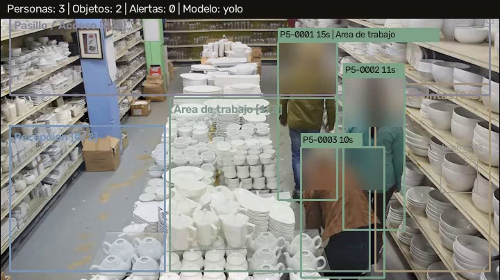
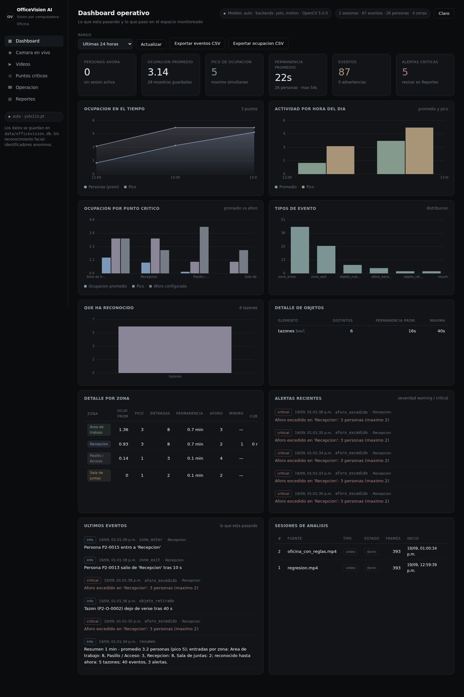
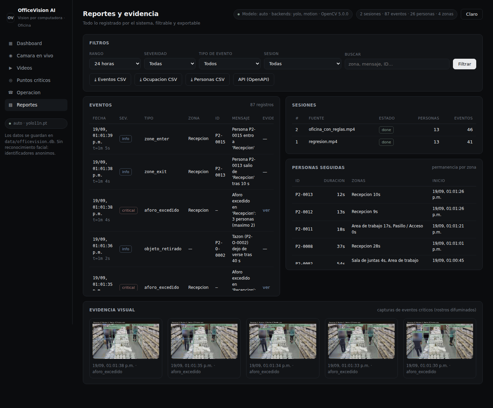
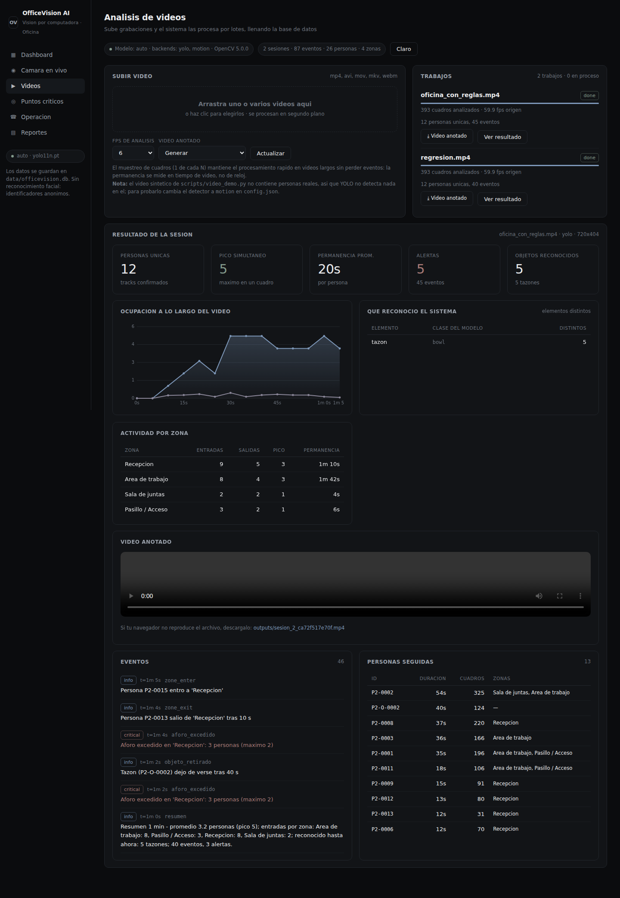
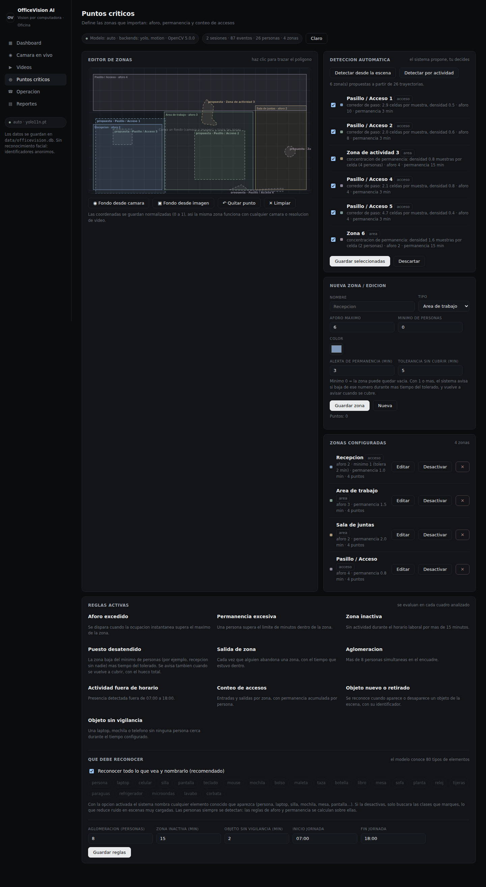
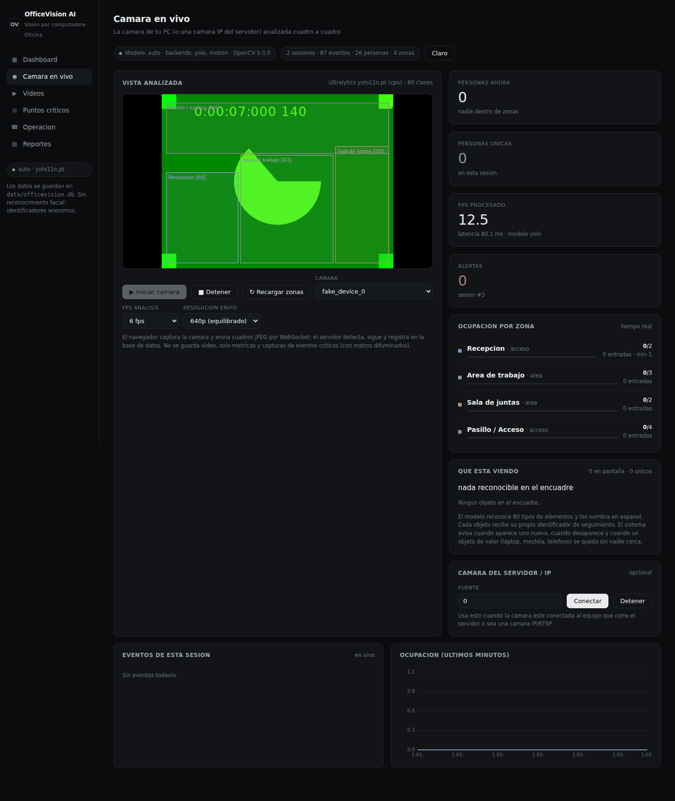
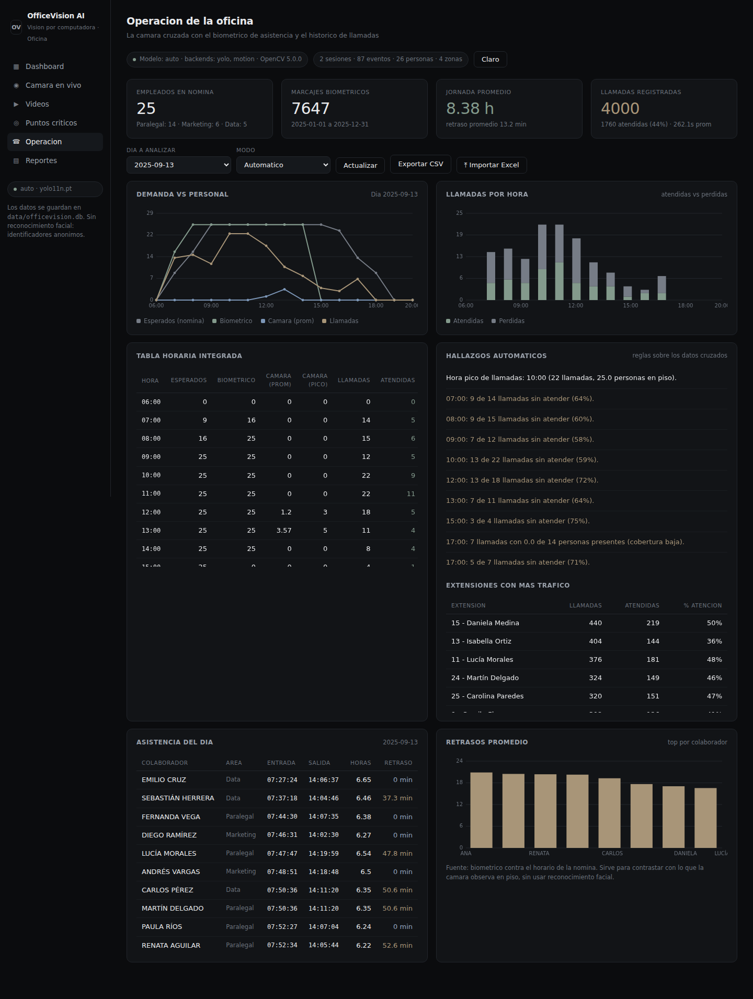

# Demostración funcional

Capturas y resultados de una ejecución real de las dos aplicaciones, con los
números que produjo el sistema. Todo lo que aparece aquí se puede reproducir con
los comandos indicados.

**Cómo se reprodujo esta demostración**

```bash
pip install -r requirements.txt

# Aplicación 1 — video
python run.py                         # http://127.0.0.1:8000
#   se subió una grabación de pasillo con personas en movimiento

# Aplicación 2 — documentos
python run_documentos.py              # http://127.0.0.1:8100
python scripts/documentos_demo.py     # genera 12 documentos de ejemplo
#   + 1 demanda federal real (doc_0011.pdf), procesada desde la interfaz
```

Los CSV que generó esta misma ejecución están en
[`docs/resultados/`](resultados/): eventos, ocupación, personas seguidas y el
inventario de documentos.

---

# 1. OfficeVision AI — análisis de video

## 1.1 Detección, seguimiento y zonas sobre el video

Cuadro del **video anotado** que genera la aplicación (se descarga desde la
pestaña *Videos*):



Lo que se ve en la imagen, todo generado por el sistema:

* **5 personas detectadas** simultáneamente, cada una con su identificador
  anónimo (`P2-0002`, `P2-0003`, `P2-0006`, `P2-0008`) y **el tiempo que lleva
  en escena** (24 s, 10 s, 8 s…).
* **La zona en la que está cada una** escrita junto a su caja (`Área de trabajo`,
  `Recepción`).
* **Las zonas dibujadas** con su nombre y su ocupación actual.
* **Rostros difuminados** automáticamente: la evidencia sirve para auditar sin
  identificar a nadie.
* Barra superior con el recuento en vivo y el modelo activo.

## 1.2 Dashboard



Resultados de la sesión mostrada (grabación de 720×404 a 59,9 fps, analizada 1 de
cada 10 cuadros → **393 cuadros analizados**):

| Métrica | Valor |
|---|---|
| Personas únicas seguidas | 12 |
| Pico simultáneo | 5 |
| Permanencia media por persona | 19,8 s |
| Ocupación promedio | 2,93 personas |
| Eventos registrados | 87 (2 sesiones) |
| Alertas críticas | 5 |
| Objetos reconocidos | 5 tazones |

Entradas y salidas por zona en esa sesión: Recepción 9/5 (pico 3), Área de trabajo
8/4 (pico 3), Sala de juntas 2/2, Pasillo 3/2.

## 1.3 Reportes y evidencia visual



La bitácora completa, filtrable y exportable. Se ve el ciclo entero de una zona:
`zone_enter` → `zone_exit` con el tiempo dentro → `aforo_excedido` cuando se
supera el máximo. Abajo, las **capturas automáticas de los eventos críticos**,
con los rostros difuminados.

Desglose de los 87 eventos: 44 entradas a zona, 26 salidas, 8 objetos nuevos,
5 aforos excedidos, 2 objetos retirados y 2 resúmenes minuto a minuto.

## 1.4 Resultado de un video procesado



Por cada video subido: métricas, ocupación a lo largo del video, actividad por
zona, inventario de objetos reconocidos, la lista de personas seguidas con su
permanencia y el video anotado para descargar.

## 1.5 Detección automática de puntos críticos



Las zonas **no vienen impuestas**. El botón *Detectar por actividad* las propone a
partir de las trayectorias ya registradas, separando permanencia de tránsito, y
cada propuesta llega con su justificación ("corredor de paso: 3.0 celdas por
muestra, densidad 0.1"). Se dibujan punteadas y sólo se guardan si se aceptan.
La otra vía, *Detectar desde la escena*, reconoce mobiliario y equipos en una foto
o video del lugar y agrupa lo que está junto.

## 1.6 Cámara en vivo



La cámara del navegador analizada cuadro a cuadro: cajas con identificador y
permanencia, ocupación por zona en tiempo real, inventario de objetos, descripción
de la escena en español y el flujo de eventos según ocurren.

## 1.7 Cruce con la operación de la oficina



La cámara puesta junto al biométrico de asistencia (25 empleados, 7 647 marcajes)
y al histórico de llamadas de RingCentral (4 000 llamadas), hora por hora, con
hallazgos automáticos del tipo *"10:00: 13 de 22 llamadas sin atender (59 %)"*.

---

# 2. DocuFlow AI — clasificación de documentos

## 2.1 Bandeja


Resultado de procesar 13 documentos (12 representativos generados + una demanda
federal real):

| Métrica | Valor |
|---|---|
| Documentos procesados | 13 (16 páginas) |
| Archivados sin intervención | **100 %** |
| Confianza media | **89,5 %** |
| En revisión | 0 |
| Errores | 0 |
| Expedientes detectados | 1 (`3:24-cv-05148-MGL`, con 7 documentos) |

Nombres generados, tal cual salieron:

```
2024-09-18_DEMANDA_3-24-cv-05148-MGL_Dona-M-Fry-v-United-State-America.pdf
2024-09-20_CITACION_3-24-cv-05148-MGL_SUMMONS-IN-A-CIVIL-ACTION.pdf
2024-10-04_MOCION_3-24-cv-05148-MGL_MOTION-EXTENSION-TIME.pdf
2024-10-11_ORDEN_3-24-cv-05148-MGL_IT-IS-SO-ORDERED.pdf
2024-02-08_RECLAMACION_sin-expediente_STANDARD-FORM-95.pdf
2023-01-15_REPORTE-POLICIAL_sin-expediente_SOUTH-CAROLINA-TRAFFIC-COLLISION-REPORT.pdf
2023-01-15_EXPEDIENTE-MEDICO_sin-expediente_LEXINGTON-MEDICAL-CENTER.pdf
2023-02-02_FACTURA_sin-expediente_INVOICE.pdf
2024-03-05_SEGURO_sin-expediente_STATE-MUTUAL-INSURANCE-COMPANY.pdf
2024-11-15_CONTRATO_sin-expediente_SETTLEMENT-AGREEMENT-RELEASE-ALL-CLAIMS.pdf
2024-05-20_DECLARACION_3-24-cv-05148-MGL_AFFIDAVIT-WITNESS.pdf
2024-04-18_CORRESPONDENCIA_3-24-cv-05148-MGL_RE-Dona-M-Fry-v-United-States-America-Case-No.pdf
2024-09-25_NOTIFICACION_3-24-cv-05148-MGL_NOTICE-APPEARANCE.pdf
```

Archivados en `data/documentos/organizados/CATEGORIA/AÑO/`. El inventario completo
está en [`docs/resultados/documentos.csv`](resultados/documentos.csv).

## 2.2 Detalle de un documento


Sobre la demanda federal real, el sistema extrajo solo:

| Dato | Valor detectado | De dónde salió |
|---|---|---|
| Título | `COMPLAINT` | línea con forma de título |
| Expediente | `3:24-cv-05148-MGL` | número de caso federal |
| Fecha | `2024-09-18` | *fecha de presentación* (etiqueta "Date Filed") |
| Partes | `Dona M. Fry` · `United State of America` | etiquetas Plaintiff / Defendant |
| Tribunal | `IN THE UNITED STATES DISTRIC COURT` | encabezado |
| Emisor | `McWHIRTER, BELLINGER & ASSOCIATES, P.A` | línea con forma jurídica |
| Monto principal | `$265,271.00` | mayor importe del documento |

Y clasificó como **Demanda / Complaint con 85 % de confianza**, explicando por qué:
`complaint` (encabezado, aporte 5.1), `jury trial demanded` (encabezado, 5.1),
`plaintiff respectfully` (encabezado, 5.1). Segunda opción: RECLAMACION (6,4 frente
a 24,2).

Desde ese mismo panel se confirma o se corrige la categoría; cada corrección
renombra y mueve el archivo, y **entrena el modelo** para los siguientes.

## 2.3 Un documento que no encaja en ninguna categoría


Un certificado de ocupación municipal: ninguna de las 21 categorías lo cubre. El
sistema no lo archiva mal — lo deja en revisión y propone los términos que lo
caracterizan (`certificate occupancy`, `zoning`, `building`…). Marcando esos
términos y poniéndole un código, la categoría queda creada y todo lo que estaba en
revisión se reprocesa:

| Momento | Categoría | Confianza |
|---|---|---|
| Al subirlo | `SIN-CLASIFICAR`, en revisión | 0 % |
| Tras crear `PERMISO` y reprocesar | `PERMISO` | **99 %**, renombrado y movido a `PERMISO/2024/` |

## 2.4 Reglas y convención de nombres


La plantilla, el separador, el largo máximo, el umbral de revisión y la estructura
de carpetas se cambian desde la interfaz, con **vista previa sobre un documento
real** y un botón para reorganizar todo lo ya archivado con la convención nueva.
Debajo, el catálogo de las 15 categorías con lo que agrupa cada una.

---

# 3. Qué se puede comprobar en estas capturas

| Requisito | Dónde se ve |
|---|---|
| Identificación de personas | §1.1, §1.2 — 12 personas únicas con identificador y permanencia |
| Identificación de objetos | §1.1, §1.2 — objetos reconocidos y nombrados en español |
| Seguimiento y permanencia | §1.3 — tabla de personas seguidas con tiempo por zona |
| Zonas / puntos críticos | §1.5 — detección automática y editor manual |
| Métricas y alertas | §1.2, §1.3 — KPIs, eventos, aforo excedido con evidencia |
| Rendimiento y lotes | §1.4 — 393 cuadros analizados con muestreo 1 de cada 10 |
| Integración | §1.7 — cruce con biométrico y llamadas; CSV y API en todas las vistas |
| Análisis documental | §2.2 — datos extraídos con su procedencia |
| Clasificación | §2.1, §2.2 — 13/13 con confianza y explicación |
| Nombramiento automatizado | §2.1, §2.3 — nombres generados y convención configurable |
| Privacidad | §1.1, §1.3 — rostros difuminados, identificadores anónimos |
