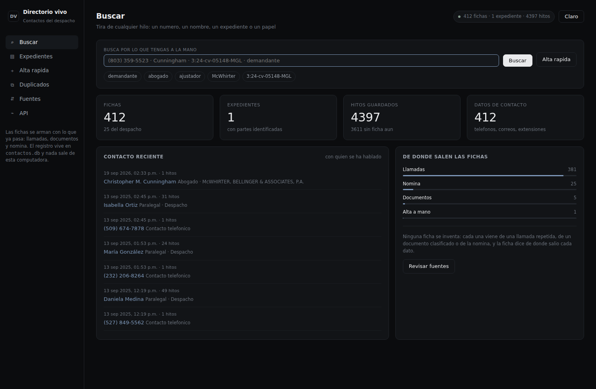
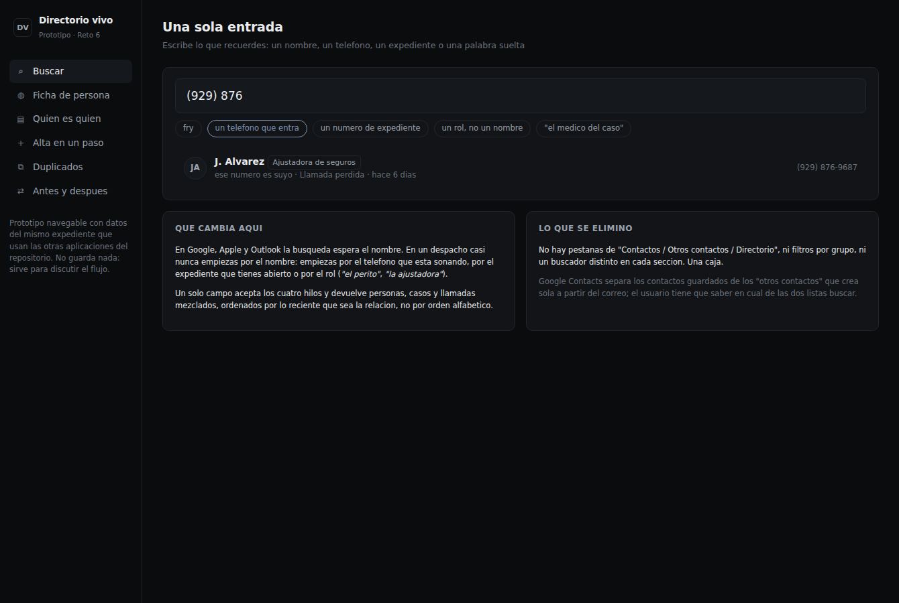
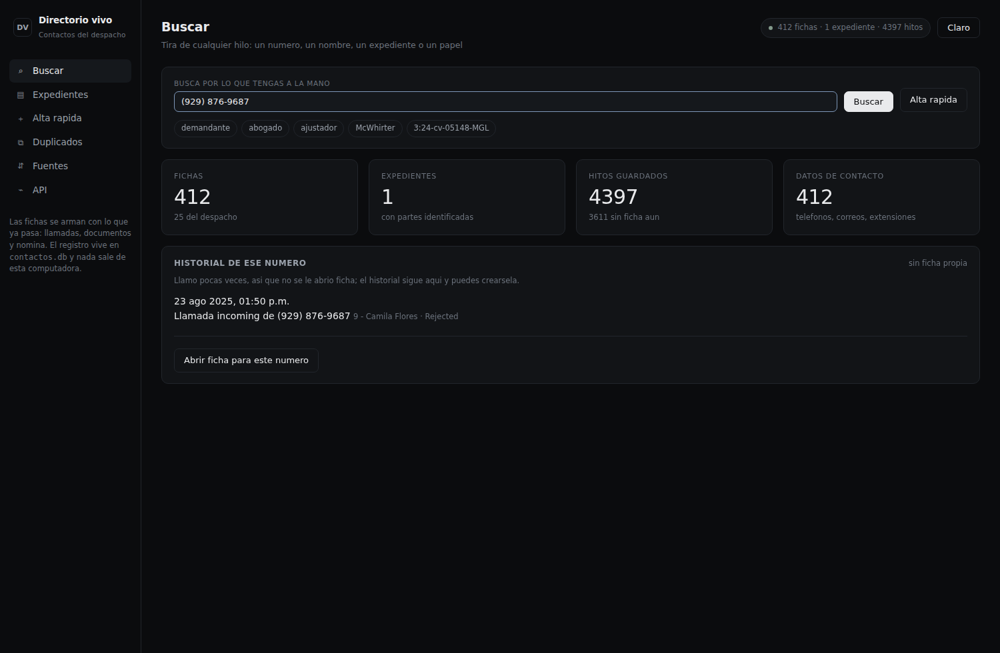
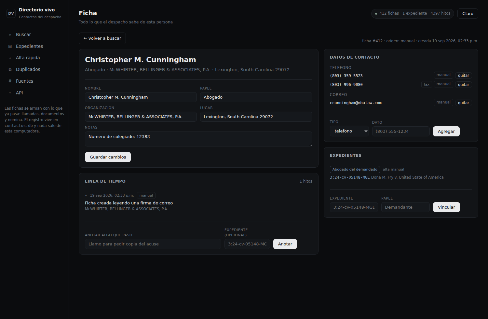
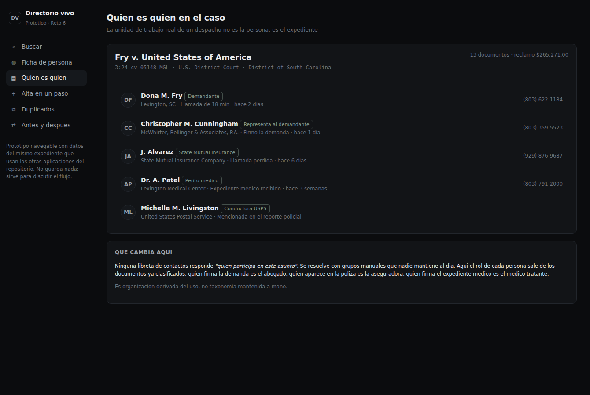
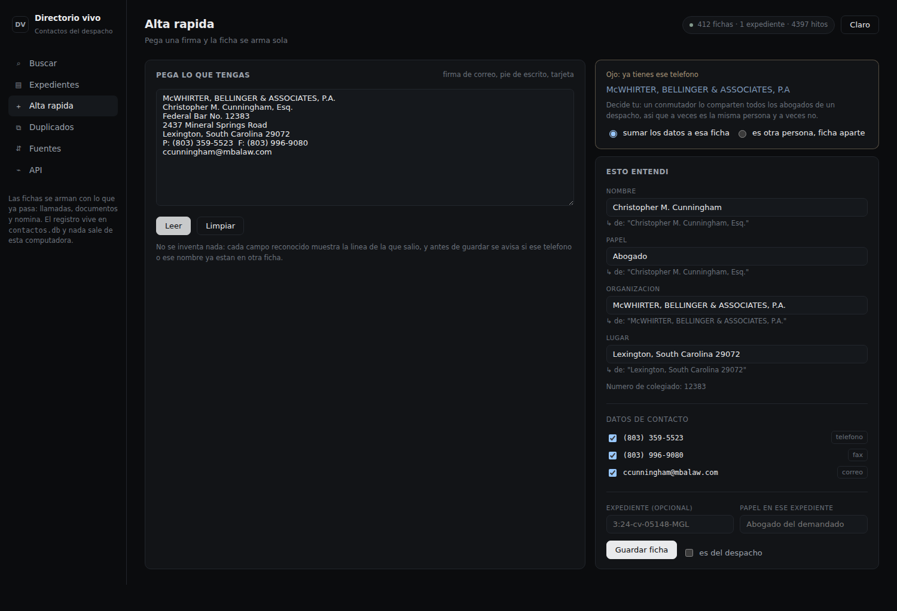
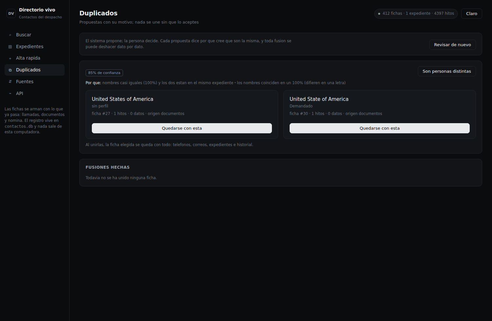
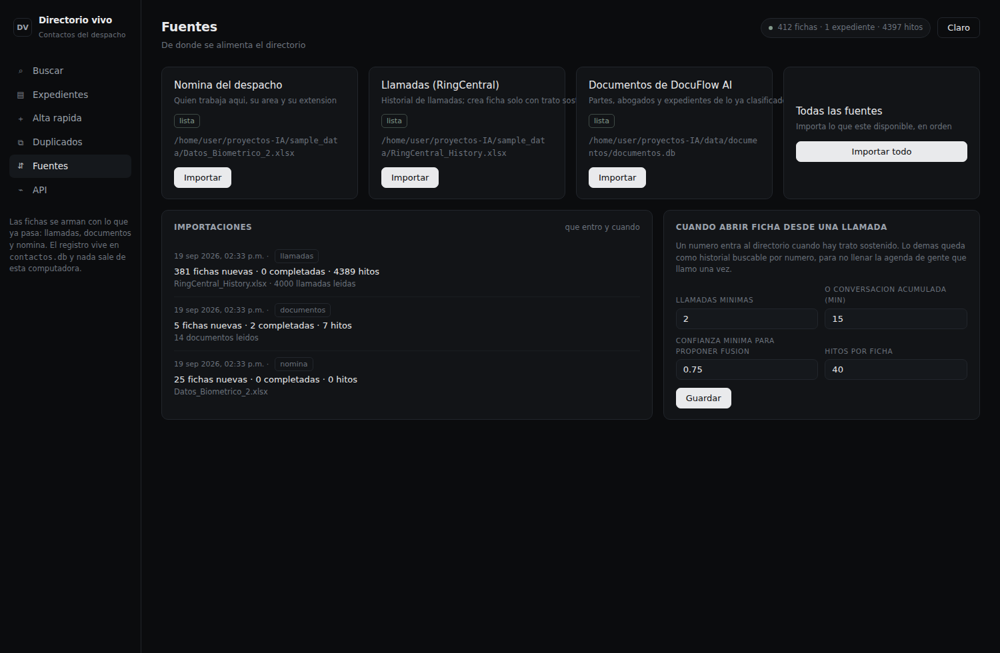

# Demostración funcional — Directorio vivo (Reto 6)

Capturas y resultados de una ejecución real del proyecto de contactos, con los números
que produjo el sistema.

**Cómo se reprodujo**

```bash
pip install -r requirements.txt
python scripts/contactos_demo.py --limpio   # arma el directorio y lo mide
python run_contactos.py                     # http://127.0.0.1:8200
```

---

## 1. Portada: una sola caja



411 fichas, 1 expediente, 4 396 hitos y 412 datos de contacto, armados en **1,6 s** a
partir de la nómina (25 personas), 4 000 llamadas de RingCentral y los 14 documentos ya clasificados
(fuente opcional: si no está, el directorio se arma igual con el resto). La barra de la derecha muestra de dónde salió cada
ficha: 381 de llamadas, 25 de nómina, 5 de documentos, 1 dada de alta a mano.

## 2. Cada resultado dice por qué aparece



Buscando `fry`: *"coincide el nombre · participa en 3:24-cv-05148-MGL como Demandante"*,
*"participa en 3:24-cv-05148-MGL como Demandado"*. La misma caja acepta un teléfono, un
expediente o un papel.



Un número que llamó una sola vez **no genera ficha** —así se evitan los 1 750 contactos
basura que produciría importar las llamadas a lo bruto— pero su historial sigue siendo
buscable, con un botón para abrirle ficha si hace falta.

## 3. La ficha es la historia



Datos de contacto etiquetados con su origen (`documento`, `manual`, `nómina`), línea de
tiempo debajo, y edición en la misma página: anotar lo que acaba de pasar o vincular a un
expediente sin cambiar de pantalla.

## 4. Quién es quién en el expediente



Las cinco partes del caso agrupadas por papel, cada una con **de dónde salió ese papel**
(*"documento DEMANDA"*, *"alta manual"*), y al lado lo que ha pasado en el expediente con
el nombre del archivo que lo originó. Esta vista no existe en Google, Apple ni Outlook.

## 5. Alta pegando una firma



De la firma real del escrito salen **ocho datos** y cada campo muestra la línea de la que
salió. Además avisa *"ya tienes ese teléfono"*: el conmutador del despacho ya estaba en
otra ficha, así que la persona decide si sumar los datos ahí o crear una ficha aparte
—un conmutador lo comparten todos los abogados de la firma—. Si elige "aparte", el
sistema recuerda que no son la misma.

## 6. Duplicados explicados y reversibles



El detector encontró solo el error tipográfico que traían los documentos —*United States
of America* frente a *United State of America*— al 85 %, con dos motivos escritos. Se
comprobó que fusionar mueve teléfonos, hitos y papeles del expediente, y que **deshacer
devuelve todo exactamente a su sitio**, incluido el papel en el caso.

## 7. Fuentes a la vista



Qué se importó, cuándo, cuántas fichas creó y cuántas completó; y los umbrales que deciden
cuándo un número merece ficha, editables sin tocar código.

---

