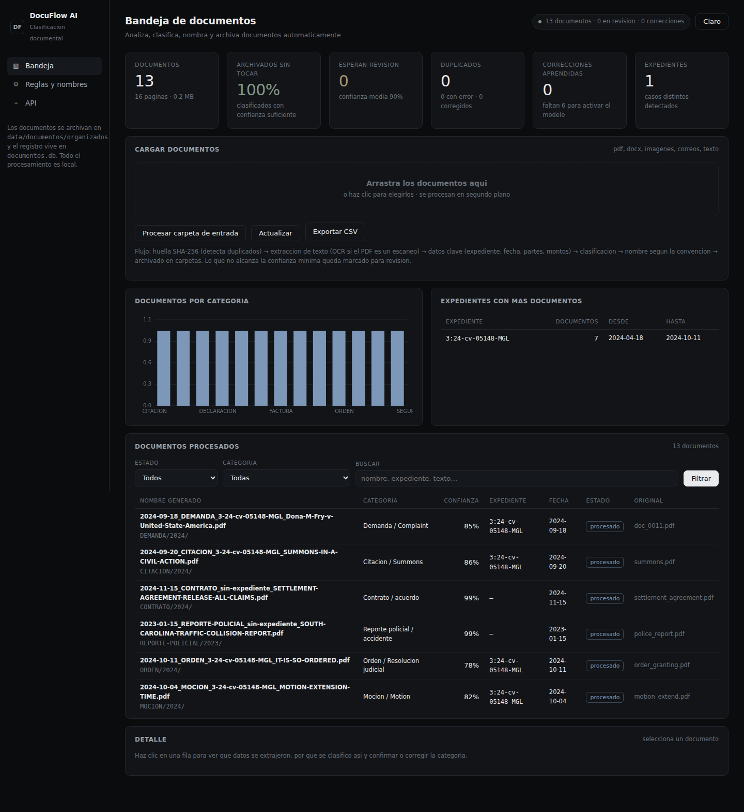
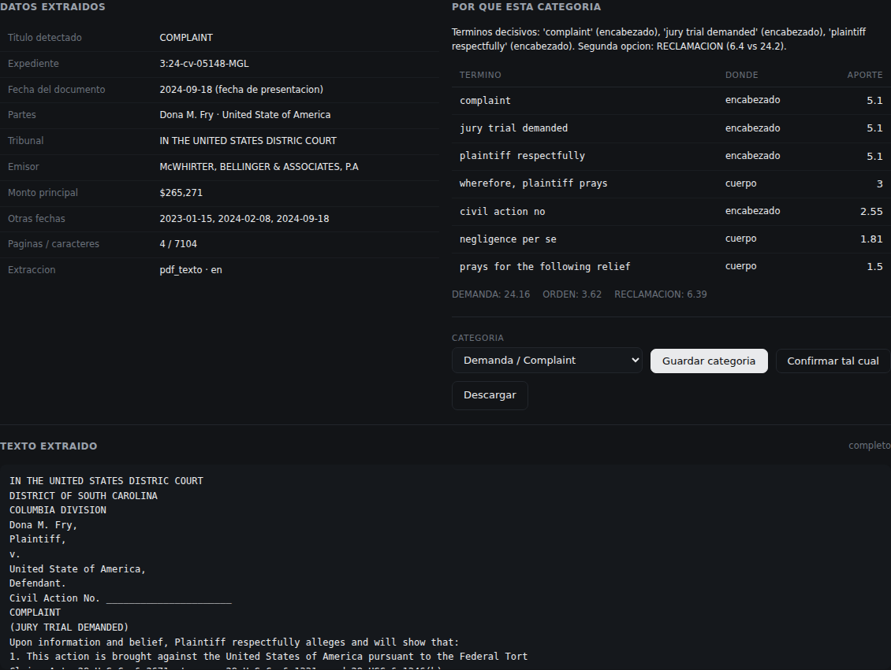
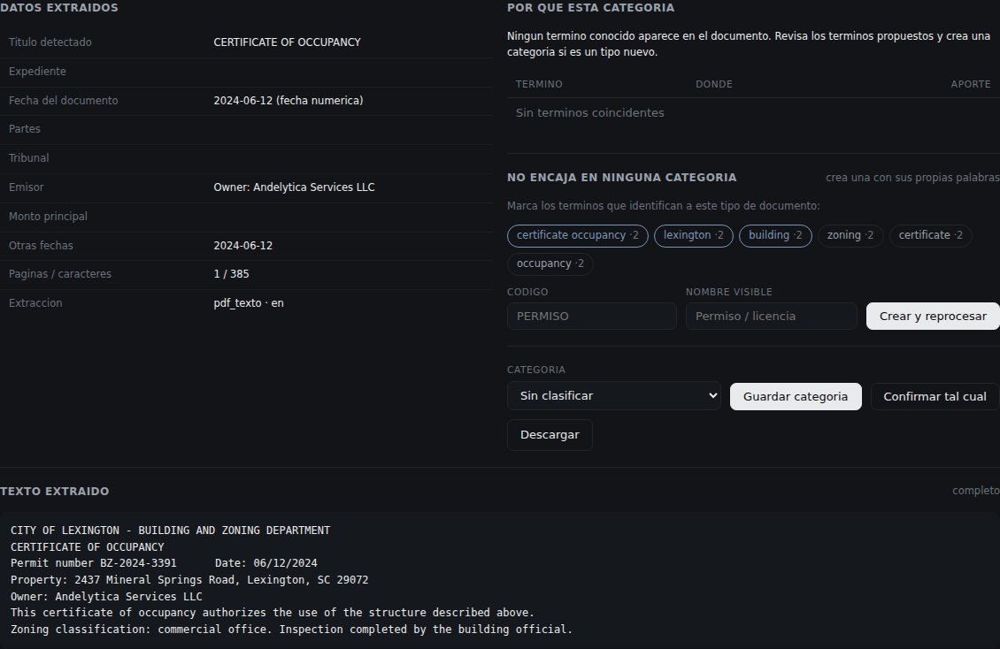
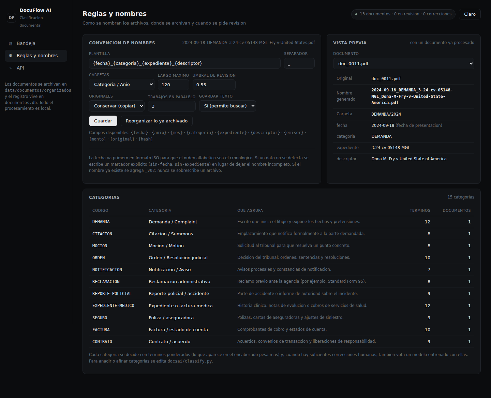

# Demostración funcional — DocuFlow AI (Reto 5)

Capturas y resultados de una ejecución real del proyecto de documentos, con los números
que produjo el sistema.

**Cómo se reprodujo**

```bash
pip install -r requirements.txt
python run_documentos.py              # http://127.0.0.1:8100
python scripts/documentos_demo.py     # genera 12 documentos de ejemplo
#   + 1 demanda federal real, procesada desde la interfaz
```

---

## 1. Bandeja



Resultado de procesar 13 documentos (12 representativos generados + una demanda
federal real):

| Métrica | Valor |
|---|---|
| Documentos procesados | 13 (16 páginas) |
| Archivados sin intervención | **100 %** |
| Confianza media | **89,5 %** |
| En revisión | 0 |
| Errores | 0 |
| Expedientes detectados | 1 (`3:24-cv-05148-MGL`, con 7 documentos) |

Nombres generados, tal cual salieron:

```
2024-09-18_DEMANDA_3-24-cv-05148-MGL_Dona-M-Fry-v-United-State-America.pdf
2024-09-20_CITACION_3-24-cv-05148-MGL_SUMMONS-IN-A-CIVIL-ACTION.pdf
2024-10-04_MOCION_3-24-cv-05148-MGL_MOTION-EXTENSION-TIME.pdf
2024-10-11_ORDEN_3-24-cv-05148-MGL_IT-IS-SO-ORDERED.pdf
2024-02-08_RECLAMACION_sin-expediente_STANDARD-FORM-95.pdf
2023-01-15_REPORTE-POLICIAL_sin-expediente_SOUTH-CAROLINA-TRAFFIC-COLLISION-REPORT.pdf
2023-01-15_EXPEDIENTE-MEDICO_sin-expediente_LEXINGTON-MEDICAL-CENTER.pdf
2023-02-02_FACTURA_sin-expediente_INVOICE.pdf
2024-03-05_SEGURO_sin-expediente_STATE-MUTUAL-INSURANCE-COMPANY.pdf
2024-11-15_CONTRATO_sin-expediente_SETTLEMENT-AGREEMENT-RELEASE-ALL-CLAIMS.pdf
2024-05-20_DECLARACION_3-24-cv-05148-MGL_AFFIDAVIT-WITNESS.pdf
2024-04-18_CORRESPONDENCIA_3-24-cv-05148-MGL_RE-Dona-M-Fry-v-United-States-America-Case-No.pdf
2024-09-25_NOTIFICACION_3-24-cv-05148-MGL_NOTICE-APPEARANCE.pdf
```

Archivados en `data/documentos/organizados/CATEGORIA/AÑO/`. El inventario completo
está en [`docs/resultados/documentos.csv`](resultados/documentos.csv).

## 2. Detalle de un documento



Sobre la demanda federal real, el sistema extrajo solo:

| Dato | Valor detectado | De dónde salió |
|---|---|---|
| Título | `COMPLAINT` | línea con forma de título |
| Expediente | `3:24-cv-05148-MGL` | número de caso federal |
| Fecha | `2024-09-18` | *fecha de presentación* (etiqueta "Date Filed") |
| Partes | `Dona M. Fry` · `United State of America` | etiquetas Plaintiff / Defendant |
| Tribunal | `IN THE UNITED STATES DISTRIC COURT` | encabezado |
| Emisor | `McWHIRTER, BELLINGER & ASSOCIATES, P.A` | línea con forma jurídica |
| Monto principal | `$265,271.00` | mayor importe del documento |

Y clasificó como **Demanda / Complaint con 85 % de confianza**, explicando por qué:
`complaint` (encabezado, aporte 5.1), `jury trial demanded` (encabezado, 5.1),
`plaintiff respectfully` (encabezado, 5.1). Segunda opción: RECLAMACION (6,4 frente
a 24,2).

Desde ese mismo panel se confirma o se corrige la categoría; cada corrección
renombra y mueve el archivo, y **entrena el modelo** para los siguientes.

## 3. Un documento que no encaja en ninguna categoría



Un certificado de ocupación municipal: ninguna de las 21 categorías lo cubre. El
sistema no lo archiva mal — lo deja en revisión y propone los términos que lo
caracterizan (`certificate occupancy`, `zoning`, `building`…). Marcando esos
términos y poniéndole un código, la categoría queda creada y todo lo que estaba en
revisión se reprocesa:

| Momento | Categoría | Confianza |
|---|---|---|
| Al subirlo | `SIN-CLASIFICAR`, en revisión | 0 % |
| Tras crear `PERMISO` y reprocesar | `PERMISO` | **99 %**, renombrado y movido a `PERMISO/2024/` |

## 4. Reglas y convención de nombres



La plantilla, el separador, el largo máximo, el umbral de revisión y la estructura
de carpetas se cambian desde la interfaz, con **vista previa sobre un documento
real** y un botón para reorganizar todo lo ya archivado con la convención nueva.
Debajo, el catálogo de las 15 categorías con lo que agrupa cada una.

---

