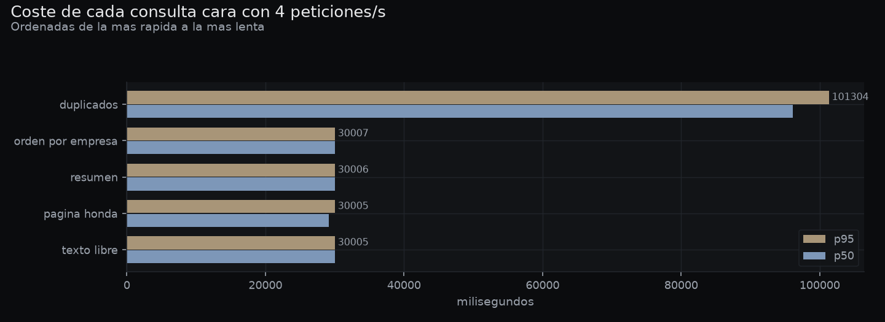

# Pruebas de tráfico, carga y actividad automatizada

**Reto 7.** Diseño, implementación y ejecución de pruebas propias sobre la solución,
con la medición y la interpretación de lo que arrojan.

> **Proyecto independiente.** Este documento se lee solo y no depende de ningún otro
> reto. El sistema que se pone a prueba es **ContactHub** (la agenda de contactos con
> API REST, JWT y SQLite). El arnés vive en `pruebas/` y se lanza con
> `python run_pruebas.py`.

Entregables de este documento:

| Pedido en el reto | Dónde está |
|---|---|
| Scripts y configuración de las pruebas | §2 · `pruebas/`, `run_pruebas.py` |
| Instrucciones para reproducirlas | §3 |
| Instalación, configuración y ejecución | §3 |
| Descripción del escenario y su justificación | §1 |
| Resultados: registros, métricas, informes, gráficas | §4 a §10 · `docs/resultados/`, `docs/img/` |

---

## 1. El escenario, y por qué es ése

### 1.1 De dónde sale la cifra

La carga no se inventa. Sale de dos archivos reales de la oficina, que están en
`sample_data/`:

* **`RingCentral_History.xlsx`** — el historial de la centralita. Su hora más cargada
  del año tiene **56 llamadas entrantes**. Cada llamada entrante es una búsqueda en la
  agenda: es literalmente para lo que se abre ContactHub cuando suena el teléfono.
* **`Datos_Biometrico_2.xlsx`** — la nómina del reloj biométrico: **26 personas**.

De ahí sale la mezcla de tráfico, operación por operación:

| Operación | Veces en la hora punta | De dónde sale ese número |
|---|---:|---|
| Buscar por texto | 56 | una por llamada entrante |
| Abrir una ficha | 39 | 7 de cada 10 búsquedas terminan abriendo la ficha |
| Listar la agenda | 78 | 26 personas × 3 veces que abren la aplicación |
| Resumen (`/stats`) | 72 | 6 pantallas abiertas, refresco cada 5 minutos |
| Etiquetas del menú | 26 | una por apertura de la aplicación |
| Filtrar por empresa o etiqueta | 20 | |
| Historial de una ficha | 8 | |
| Buscar duplicados | 1 | limpieza ocasional |
| Alta de contacto | 9 | clientes nuevos del día, repartidos |
| Editar contacto | 12 | correcciones sobre la marcha |
| Acción en bloque | 4 | etiquetar varios de una vez |
| **Total** | **325 peticiones / hora** | **= 0,090 peticiones por segundo** |

Ese número —**nueve centésimas de petición por segundo**— es el resultado más útil de
todo el reto y conviene decirlo antes que ningún otro: la demanda real de este despacho
es diminuta. Todas las cifras de tres dígitos que aparecen más abajo no son la carga
esperada; son **el margen que hay antes de que el sistema se rompa**, expresado también
en "cuántas horas punta reales caben ahí dentro".

### 1.2 Contra qué datos se mide

Medir búsquedas sobre una agenda vacía no mide nada. Antes de cada sesión el arnés
siembra la agenda con **2 000 contactos** construidos con los nombres y los puestos
reales de la nómina y los teléfonos reales del historial de la centralita, combinando
apellido paterno y materno para obtener 676 nombres completos distintos.

La siembra **no escribe en la base de datos por detrás**: genera un CSV en formato Google
Contacts y lo sube por el mismo endpoint de importación que usa una persona
(`POST /api/v1/imports/google-csv`). Así la prueba entra por donde se entra de verdad, y
de paso mide lo que tarda esa importación.

Después, el arnés **pregunta al sistema** contra qué va a medir: lee identificadores,
apellidos, empresas y etiquetas repartidos por toda la agenda. No los da por supuestos.
Si la agenda estuviera vacía, lo dice y se planta, porque los 404 que saldrían entonces
serían fallos de la prueba, no del sistema.

### 1.3 Las diez pruebas y qué busca cada una

| # | Prueba | Qué pregunta responde |
|---|---|---|
| 1 | Arranque en frío | Qué espera la primera persona del día, pantalla por pantalla |
| 2 | Ráfaga | ¿Y si entran todas de golpe desde reposo? |
| 3 | Escrituras concurrentes | ¿Varias personas escribiendo a la vez se pisan? |
| 4 | Sólo consultas caras | ¿Cuál es la consulta que se rompe primero? |
| 5 | Resistencia | ¿Se degrada o pierde memoria con el tiempo? |
| 6 | Importación grande en marcha | ¿La agenda queda inservible mientras importa? |
| 7 | Tolerancia a errores | ¿Cómo falla: defendiéndose (4xx) o roto (500)? |
| 8 | Integridad | ¿Sigue la agenda coherente después de la paliza? |
| 9 | **Caudal sostenible** | ¿Cuánto aguanta **de verdad**, en tramos de dos minutos? |
| 10 | Escalada | ¿A partir de qué caudal se cae, y cuánto tarda en volver? |

**El orden no es casual.** Las dos últimas tumban el servicio a propósito, y después
de tumbarlo tarda minutos en volver (§5.5). Si fueran antes, todo lo demás se
mediría sobre la cola de su caída — que es justo lo que pasó en un intento previo y
produjo un 100 % de errores que no era de nadie (§7.1).

### 1.4 Tres decisiones de método que cambian lo que se mide

**Llegadas de Poisson, no un bucle cerrado.** Lo habitual —"N usuarios que piden,
esperan la respuesta y vuelven a pedir"— esconde la saturación: si el servidor se frena,
el generador también, y las latencias salen bonitas. Aquí las peticiones se programan a
una tasa fija con intervalos exponenciales, como llega el tráfico real; si el servidor no
da abasto, la cola crece y se ve.

**Se mide la espera del usuario, no la del servidor.** El reloj arranca cuando la
petición *debía* salir, no cuando sale. Esa diferencia se llama *coordinated omission* y
es justo lo que se siente cuando un sistema empieza a ir mal. El informe guarda las dos:
`latencia_ms` (lo que espera la persona) y `servicio_ms` (lo que tarda el servidor).

**Consultas distintas en cada petición.** Las búsquedas rotan entre decenas de apellidos
reales y las fichas que se abren se reparten entre 144 identificadores distintos.
Repetir siempre la misma habría medido la caché, no la búsqueda.

---

## 2. Qué se entrega y dónde está

| Archivo | Qué es |
|---|---|
| `run_pruebas.py` | El comando único: arranca, entra, siembra, mide, vigila, dibuja y limpia |
| `pruebas/contacthub.py` | Dónde está ContactHub, cómo se entra (JWT y su renovación) y con qué datos se siembra |
| `pruebas/carga.py` | Motor de carga: llegadas de Poisson, uno o varios procesos, percentiles |
| `pruebas/escenarios.py` | La mezcla de tráfico y la batería de casos borde, con su justificación en el código |
| `pruebas/monitor.py` | Vigilancia de CPU, memoria, hilos y conexiones del servidor |
| `pruebas/orquesta.py` | Ciclo de vida del servidor y los ocho escenarios |
| `pruebas/reporte.py` | Las gráficas |
| `pruebas/informe_html.py` | El informe HTML: una página que se abre con doble clic |
| `pruebas/extraer_log.py` | Saca del registro del servidor el recuento de errores y una traza de cada clase |
| `iniciar-pruebas.bat` | Lanzador para Windows: comprueba el entorno y ejecuta la sesión |
| `data/pruebas/<fecha>/informe.html` | **El informe para leer**: resumen, tablas y gráficas en una sola página |
| `data/pruebas/<fecha>/` | Datos en crudo: **una fila por petición**, más `informe.json` y el log del servidor |
| [`docs/resultados/carga-registro.txt`](resultados/carga-registro.txt) | **Transcripción completa** de la sesión: qué se ejecutó, en qué orden y con qué resultado |
| `docs/resultados/carga-peticiones-nivel-maximo.csv` | **Registro de peticiones** del nivel más alto ejecutado, una fila por petición |
| [`docs/resultados/carga-log-contacthub.txt`](resultados/carga-log-contacthub.txt) | Salida del propio ContactHub durante la sesión, con sus trazas de error |
| [`docs/resultados/carga-sostenido-15rps.csv`](resultados/carga-sostenido-15rps.csv) | El caudal sostenible, petición a petición: el último limpio |
| [`docs/resultados/carga-sostenido-20rps.csv`](resultados/carga-sostenido-20rps.csv) | Y el primero que falla, para poder comparar los dos |
| `docs/resultados/carga-*.csv` | Medidas de recursos, de resistencia y de escrituras |
| `docs/img/carga-*.png` | Las gráficas |

No hace falta ninguna herramienta externa —ni Locust, ni JMeter, ni k6—: se usa `httpx`,
que ya viene con FastAPI, más `psutil`, `matplotlib` y `openpyxl`. La prueba se ejecuta
con las mismas dependencias del proyecto y no hay nada más que instalar ni configurar.

**El arnés no toca ContactHub.** No importa su código, no abre su base de datos, no lee
su `.env`. Habla con él sólo por HTTP, como cualquier cliente. Por eso las mismas
pruebas valen igual si ContactHub se despliega en otra máquina: basta apuntar
`CH_BASE` a su dirección.

---

## 3. Cómo reproducirlo

**En Windows, lo más corto:** arranca ContactHub con su `iniciar.bat` y luego haz
doble clic en **`iniciar-pruebas.bat`**. Comprueba el entorno, avisa de lo que
falte y lanza la sesión completa.

Y si prefieres la línea de órdenes, o estás en Linux o Mac:

```bash
# 1) Dependencias (las mismas del proyecto)
pip install -r requirements.txt

# 2) Comprobar el entorno: dice si encuentra ContactHub
python run_pruebas.py --check

# 3) La sesión completa
python run_pruebas.py
```

**Si ContactHub ya está arrancado** (con su `iniciar.bat`, por ejemplo), el arnés lo
detecta, mide contra él y **no lo apaga al terminar**. Si no lo está, lo busca en las
rutas habituales y lo arranca él mismo. Si no lo encuentra, se le dice dónde:

```bash
python run_pruebas.py --ruta "C:\Users\JOEL\Desktop\ContactHub-entrega\ContactHub"
```

### El informe HTML

Al terminar, la sesión deja un **`informe.html`** junto al resto de resultados. Se
abre con doble clic y lleva **las gráficas incrustadas dentro del propio archivo**:
no hay carpetas que acompañar ni enlaces que se rompan al moverlo, así que se puede
enviar por correo o imprimir tal cual. Se adapta al móvil y tiene hoja de estilos de
impresión.

Si ya ejecutaste una sesión y quieres rehacer sólo el informe —por ejemplo tras
cambiar algo del formato— no hace falta volver a medir:

```bash
python run_pruebas.py --html data/pruebas/20260920_011911
```

Una copia del informe de la última sesión completa queda además en
[`docs/resultados/carga-informe.html`](resultados/carga-informe.html).

Opciones útiles:

```bash
python run_pruebas.py --rapido             # versión corta, ~2 min, para comprobar que va
python run_pruebas.py --solo errores       # sólo la batería de casos borde
python run_pruebas.py --solo escalada rafaga
python run_pruebas.py --solo sostenible   # sólo la escalera de caudal sostenible
python run_pruebas.py --sin-importacion    # omitir la prueba más lenta
python run_pruebas.py --contactos 5000     # medir contra una agenda mayor
```

Configuración por variables de entorno, si hace falta:

| Variable | Para qué | Por defecto |
|---|---|---|
| `CH_BASE` | Dirección de ContactHub | `http://127.0.0.1:8765` |
| `CH_PUERTO` | Puerto, si sólo cambia eso | `8765` |
| `CONTACTHUB_DIR` | Carpeta de ContactHub | se busca sola |
| `CH_USUARIO` / `CH_CLAVE` | Cuenta de pruebas | `pruebas.carga@grupoilalo.com` |

**La cuenta de pruebas es una cuenta normal**, creada por el endpoint público de
registro. No se toca la base de datos ni se fabrican tokens: el arnés hace login como
cualquiera y renueva el token cuando le quedan menos de dos minutos de vida, porque una
sesión de pruebas dura más que los 15 minutos que dura un *access token* de ContactHub.

**La prueba limpia lo que ensucia.** Todo lo que crean los escenarios de escritura lleva
la empresa `Prueba de carga`, y al terminar se localiza con el mismo filtro público de la
API y se borra en bloque. El informe dice cuántos registros retiró. Los 2 000 contactos
sembrados **sí se quedan**: volver a sembrarlos en cada corrida tarda más que la propia
prueba, y el arnés detecta que ya están.

**Aislamiento.** Todo lo que hace la prueba ocurre bajo su propia cuenta. ContactHub
separa los contactos por usuario, así que la agenda real de quien use la aplicación no se
ve ni tocada ni contada.

---

## 4. Todo el informe en una tabla

| Pregunta | Respuesta medida |
|---|---|
| ¿Cuánta carga tiene de verdad este despacho? | **0,090 peticiones/s** (325 en la hora punta) |
| ¿Cuánto aguanta ContactHub de forma sostenida? | **15 peticiones/s** sin un solo error = **166× la demanda real** |
| ¿Y en tramos cortos? | 20 pet./s durante 20 s van limpias… y durante 120 s fallan el 76 % |
| ¿Cuántas peticiones simultáneas soporta? | **50** de golpe sin errores; con 60 fallan 40 |
| ¿Y las consultas caras? | Sólo **4 pet./s**: el límite depende de qué se pida |
| ¿Qué pasa al pasarse? | No se degrada: **se cae**, y tarda **1 min 35 s** en volver |
| ¿Por qué? | **15 conexiones a la base para 40 hilos** (§5) |
| ¿Se arregla? | Sí, **una línea**: el punto de rotura pasa de 60 a >100 simultáneas (§5.7) |
| ¿Aguanta escrituras concurrentes? | 8/s con **p95 de 139 ms y cero errores** |
| ¿Aguanta trabajo pesado en segundo plano? | Sí: importando 3 000 contactos, la agenda responde en **277 ms, 0 errores** |
| ¿Se defiende de peticiones maliciosas? | **43 de 43 casos correctos, 0 errores 500** |
| ¿Se encontró algún defecto? | Sí: **dos altas simultáneas con la misma etiqueta nueva dan HTTP 500** (§8.8) |
| ¿Perdió algún dato? | **Ninguno**: 25 de 25 fichas de referencia intactas |
| ¿Cuántos fallos tuvo la propia prueba? | **Siete**, todos documentados en §7 |

---

## 5. El hallazgo principal: por qué se cae, exactamente

Este apartado va antes que la tabla de resultados porque explica todos los números
que vienen después. No es una hipótesis: está reproducido, medido y confirmado con
el volcado de pila del propio ContactHub.

### 5.1 El síntoma

Por encima de cierto caudal, ContactHub no se ralentiza: se cae. Y se cae **con la
CPU ociosa**, lo cual descarta de entrada que falte máquina.

### 5.2 La traza

El registro del propio servidor lo dice con todas las letras:

```
sqlalchemy.exc.TimeoutError: QueuePool limit of size 5 overflow 10 reached,
connection timed out, timeout 30.00
```

`app/db.py` crea el motor así:

```python
def make_engine(url: str) -> Engine:
    kwargs: dict = {"pool_pre_ping": True}
    is_sqlite = url.startswith("sqlite")
    if is_sqlite:
        kwargs["connect_args"] = {"check_same_thread": False}
        if url in ("sqlite://", "sqlite:///:memory:"):
            kwargs["poolclass"] = StaticPool
    engine = create_engine(url, **kwargs)
```

No se configura el pool, así que SQLAlchemy aplica el suyo por defecto: **5
conexiones + 10 de desbordamiento = 15**, con 30 segundos de espera antes de
rendirse.

Enfrente, FastAPI atiende los endpoints **síncronos** (los de ContactHub lo son:
`def`, no `async def`) en un grupo de **40 hilos**.

**40 hilos contra 15 conexiones.** Ahí está todo.

### 5.3 El mecanismo, paso a paso

`get_current_user` consulta la base **en cada petición**, antes de llegar siquiera al
endpoint: es la dependencia que valida el token y carga el usuario. Cuando entran más
peticiones a la vez que conexiones hay:

1. Los 40 hilos se llenan de peticiones paradas en `get_current_user` esperando una
   conexión.
2. Las que sí tienen conexión necesitan **otro turno de hilo** para ejecutar el
   endpoint y cerrar la sesión. No hay ninguno libre.
3. Cada espera caduca a los 30 segundos con un HTTP 500, y el hueco que deja lo
   ocupa al instante la siguiente petición en cola.

El volcado de pila durante la caída (con `py-spy`, sin tocar el proceso) lo confirma:

```
hilos: 48
donde estan parados:
   40  wait (threading.py:331)          <- esperando conexion a la base
    7  wait (threading.py:327)          <- trabajadores ociosos
    1  run (asyncio/runners.py:118)     <- el bucle principal

dentro del codigo de ContactHub:
   40  get_current_user (app/security/deps.py:54)
```

Y muestreado en el tiempo, **sin ninguna carga nueva entrando**, el número no baja:

```
  t+  0s  hilos esperando conexion a la base:  40 de 44 trabajadores
  t+ 40s  hilos esperando conexion a la base:  40 de 43 trabajadores
  t+ 90s  hilos esperando conexion a la base:  40 de 43 trabajadores
```

### 5.4 La confirmación aritmética

La ráfaga de 60 peticiones simultáneas da **66,67 % de errores**. Eso es
exactamente 40 de 60: fallan los 40 hilos que se quedan esperando conexión y pasan
las 20 que sí la consiguen. La cifra se repitió al decimal en dos sesiones
independientes (66,67 % y 66,67 %), lo que descarta que sea ruido.

### 5.5 Lo caro que sale: 20 segundos de sobrecarga, minutos de servicio caído

La consecuencia práctica es peor que la caída en sí. El atasco sólo drena a razón de
unas **40 peticiones cada 30 segundos**, porque ése es el coste de cada espera
caducada. Veinte segundos de sobrecarga a 40 peticiones/s generan unas 800
peticiones; de ellas 741 caducaron en el cliente, y el servicio tardó **unos 6
minutos** en volver a contestar.

Eso obligó a rehacer el orden de la propia sesión de pruebas (§7.1).

### 5.6 Lo que NO es

Sospeché que las conexiones se filtraban cuando el cliente corta a mitad de
petición. **Me equivocaba.** Lo probé: 40 peticiones abortadas a los 25 ms, y
`/health` siguió respondiendo 200 durante y después, sin pérdida de capacidad.

```
antes de nada          -> /health 200
tras  10 cortes        -> /health 200
tras  20 cortes        -> /health 200
tras  30 cortes        -> /health 200
tras  40 cortes        -> /health 200
```

No hay fuga. Es congestión con un coste de 30 segundos por petición fallida.

### 5.7 La corrección, probada

Basta configurar el pool para que dé abasto a los hilos que hay. En una copia de
trabajo de ContactHub, añadiendo una línea a `make_engine`:

```python
kwargs["connect_args"] = {"check_same_thread": False}
kwargs.update(pool_size=48, max_overflow=16, pool_timeout=5)   # <- esta
```

| Peticiones simultáneas | Sin la línea | Con la línea |
|---:|---|---|
| 40 | 100 % bien · máx 1,3 s | 100 % bien · máx 1,5 s |
| 60 | **67 % de errores** (40 HTTP 500 a los 30 s) | 100 % bien · máx 2,2 s |
| 100 | — | **100 % bien** · máx 2,8 s |
| 200 | — | 60 % de errores |

El punto de rotura pasa de **60 a más de 100 peticiones simultáneas**: más del
triple, con una línea y sin tocar nada más.

`pool_timeout=5` importa tanto como el tamaño: convierte una espera de 30 segundos
que acaba en 500 en un rechazo rápido, que es lo que un cliente puede reintentar sin
tumbar el servicio.

**Los números de §6 en adelante son los de ContactHub *sin* esa línea**, tal y como
está. El archivo se restauró antes de medir.

### 5.8 Un efecto colateral que importa para operar

`/health` también consulta la base (`SELECT 1`). Bajo saturación, el chequeo de salud
tarda lo mismo que todo lo demás y acaba caducando. Un supervisor, un balanceador o
un script de arranque que reinicie según `/health` daría el servicio por muerto justo
cuando sólo está ocupado, y lo reiniciaría en el peor momento posible. Un chequeo de
vida no debería depender del recurso que se agota.

---

## 6. Resultados

Todo lo de aquí viene de una sola sesión, ejecutada de principio a fin sobre un
ContactHub recién arrancado, cuya transcripción completa está en
[`docs/resultados/carga-registro.txt`](resultados/carga-registro.txt) y cuyo informe
para leer está en [`docs/resultados/carga-informe.html`](resultados/carga-informe.html).

**Máquina:** Linux, 4 núcleos lógicos, 16,9 GB de RAM, Python 3.11.
**Agenda:** 5 144 contactos. **Duración:** 20 min 03 s.

Y un dato que da confianza en el resto: **ningún escenario tuvo que esperar a que el
servicio se recuperara del anterior**. Las esperas registradas son todas cero, lo que
significa que cada medida es del sistema, no de la resaca de la prueba previa.

### 6.1 El número que importa: 15 peticiones/s sostenidas


| Caudal sostenido 120 s | × la hora punta real | p95 | Errores |
|---:|---:|---:|---:|
| 5 pet./s | 55× | 137 ms | 0,00 % |
| 10 | 111× | 295 ms | 0,00 % |
| **15** | **166×** | **379 ms** | **0,00 %** |
| 20 | 222× | 101 900 ms | **75,99 %** |

**ContactHub sostiene 15 peticiones por segundo sin un solo error: 166 veces la
demanda real de este despacho.** Ése es el número que hay que apuntar.

Y aquí está por qué hace falta medirlo con tramos largos. En la misma sesión, el
mismo caudal, el mismo servidor:

| 20 peticiones/s | Resultado |
|---|---|
| durante **20 segundos** | p95 466 ms · **0,00 % de errores** |
| durante **120 segundos** | p95 101 900 ms · **75,99 % de errores** |

Veinte segundos no bastan para que la cola se acumule. Una escalada de tramos
cortos habría dado 20 pet./s como caudal limpio, y habría sido falso.

### 6.2 Escalada: dónde se cae

| Caudal ofrecido | × la hora punta | p95 | Errores | Servidas/s |
|---:|---:|---:|---:|---:|
| 1 pet./s | 11× | 64 ms | 0,00 % | 1,4 |
| 5 | 55× | 116 ms | 0,00 % | 5,7 |
| 10 | 111× | 238 ms | 0,00 % | 10,3 |
| 20 | 222× | 466 ms | 0,00 % | 17,7 |
| 25 | 277× | 52 200 ms | **54,27 %** | 5,0 |

No hay degradación suave: entre 20 y 25 peticiones/s se pasa de medio segundo y
cero errores a 52 segundos y la mitad de las peticiones perdidas. Es un
acantilado, y la razón está en §5.

Después de caerse, el servicio tardó **1 min 35 s** en volver a estar en pie.


### 6.3 Ráfaga: todas a la vez desde reposo

| Simultáneas | p95 | Errores |
|---:|---:|---:|
| 10 | 579 ms | 0,00 % |
| 20 | 1 359 ms | 0,00 % |
| 30 | 2 210 ms | 0,00 % |
| 40 | 2 737 ms | 0,00 % |
| **50** | **3 177 ms** | **0,00 %** |
| 60 | 31 713 ms | **66,67 %** |

Cincuenta de golpe: ninguna falla. Sesenta: fallan cuarenta, que son exactamente
los cuarenta hilos que se quedan sin conexión (§5.4). **Ese 66,67 % se repitió al
decimal en tres sesiones independientes.**

Y una diferencia que importa: **una ráfaga se recupera al instante** —son 60
peticiones y se acaban—, mientras que la carga sostenida deja cola para minutos.

### 6.4 Escrituras concurrentes

| Operación | Peticiones | p95 | Errores |
|---|---:|---:|---:|
| Alta de contacto | 72 | 37 ms | 0,00 % |
| Editar contacto | 103 | 53 ms | 0,00 % |
| Acción en bloque (20 fichas) | 30 | 402 ms | 0,00 % |
| **Total** | **205** | **139 ms** | **0,00 %** |

Ocho escrituras por segundo —89 veces el ritmo real de escritura del despacho— sin
un solo error. Escribir no es el problema: el cuello es el mismo pool de conexiones
que limita las lecturas, no nada propio de SQLite escribiendo.


### 6.5 Las consultas caras: el límite real es mucho más bajo

**Cuatro** peticiones por segundo de consultas caras —texto libre con `limit=200`,
paginación honda, ordenación por empresa y detección de duplicados— bastan para
tumbarlo: p95 de 95 segundos y **65,77 % de errores**.

Cuatro. Frente a las 15 que aguanta la mezcla normal. **El caudal que soporta un
sistema no es un número: depende de qué se le pide.**

La culpable se ve ya en el arranque en frío: con 5 144 contactos, la detección de
duplicados tarda **2,2 segundos** por petición. Con 2 000 contactos tardaba 220 ms.
Diez veces más lenta con dos veces y media más datos: no escala linealmente.



### 6.6 Arranque en frío

| Pantalla | Primera vez | Repetida |
|---|---:|---:|
| Estado del servicio | 3 ms | 2 ms |
| Quién soy | 3 ms | 3 ms |
| Resumen de la libreta | 54 ms | 53 ms |
| Primera pantalla de contactos | 23 ms | 22 ms |
| Etiquetas del menú | 16 ms | 14 ms |
| Buscar un apellido | 35 ms | 31 ms |
| **Posibles duplicados** | **2 206 ms** | **2 178 ms** |
| Mi perfil | 11 ms | 4 ms |

No hay penalización de arranque: la primera llamada cuesta lo mismo que la segunda.

### 6.7 Resistencia: caudal sostenido

120 segundos seguidos a 6 peticiones/s: **p95 de 152 ms y cero errores**. Ni
degradación a lo largo del tiempo ni sorpresas.


### 6.8 Importación grande mientras la oficina sigue buscando

Con una importación de **3 000 contactos** corriendo en segundo plano, la agenda
respondió con **p95 de 277 ms y cero errores**. El trabajo pesado no bloquea la
consulta.

> **Salvedad honesta:** en esta sesión concreta la importación procesó 3 000 filas
> que **ya existían** de una sesión anterior, así que ContactHub las dio por
> `unchanged` en vez de crearlas. El trabajo de parsear el CSV, normalizar teléfonos
> y correos y buscar coincidencias sí se hizo entero —que es la parte pesada—, pero
> las 3 000 escrituras no. Está corregido en el arnés (cada sesión usa ahora un rango
> de contactos distinto), pero **este número concreto mide una importación sin
> escrituras**, y así queda dicho.

### 6.9 Integridad: no se perdió nada

| | |
|---|---|
| Contactos antes | 5 144 |
| Contactos después | 5 216 |
| En la papelera | 202 (los que creó y borró la propia prueba) |
| **Fichas de referencia vivas** | **25 de 25** |
| El servicio responde | Sí |

Después de las ráfagas, las escrituras concurrentes, las consultas caras, el caudal
sostenido, la importación, 43 casos maliciosos y una escalada hasta el colapso,
**la libreta quedó exactamente como debía**. La limpieza retiró los 216 registros
que la prueba había creado.

### 6.10 Recursos


| | |
|---|---|
| CPU media | 48,1 % |
| CPU pico | 191,3 % (de 400 % disponibles) |
| Memoria | 150 → 647 MB (pico de 1 067 MB) |
| Hilos (máximo) | 73 |
| Conexiones (máximo) | 201 |

La CPU nunca pasó de la mitad de la máquina, ni siquiera durante el colapso: eso es
lo que delata que el cuello no es de cálculo.

El crecimiento de memoria **no está demostrado que sea una fuga**: la sesión importó
3 000 contactos y la libreta creció. Para hablar de fuga habría que medir con la
misma cantidad de datos al principio y al final, y esta sesión no lo hace. Queda
señalado como **no medido**, no como descartado.

---

## 7. Lo que falló en la propia prueba

Una prueba de carga mal hecha no da un resultado malo: da un resultado **convincente y
falso**. Estos siete fallos eran míos, no de ContactHub, y todos habrían producido
cifras publicables y equivocadas.

### 7.1 Medir sobre la resaca del escenario anterior

**Lo que pasó.** La escalada iba la segunda de la sesión. Tumbaba ContactHub y, como
el servicio tarda minutos en volver (§5.5), todo lo que venía detrás se medía sobre
esa cola. Las ráfagas salieron con un **100 % de errores** en todos los tamaños,
incluso en la de 10 simultáneas, que en realidad va sobrada.

**Por qué es grave.** Ese 100 % era publicable. "ContactHub falla en todas las ráfagas"
es una frase que se sostiene sola en un informe y que es rotundamente falsa: la
ráfaga de 50 da **0 % de errores** cuando se mide sobre un sistema sano.

**Qué se hizo.** Dos cosas. La escalada pasó a ser el **último** escenario, porque es
el único que destruye el servicio a propósito. Y cada escenario llama ahora a
`orq.en_pie()` antes de medir: si `/health` no contesta, espera, y deja escrito
cuánto tuvo que esperar. Eso se ve funcionando en el registro de la sesión:

```
5. Resistencia: caudal sostenido
    [resistencia] el servicio viene tocado del escenario anterior;
                  esperando a que vuelva … listo en 25s
    120s seguidos a 20 peticiones/s … 
```

Sin esa línea, ese número habría sido "la resistencia de ContactHub".

### 7.2 Buscar 2 000 veces el mismo apellido

**Lo que pasó.** El arnés lee de la propia agenda los apellidos con los que va a
buscar, para no inventárselos. Los leía de la **primera página ordenada por nombre**.
De 2 000 contactos salían **dos apellidos distintos**.

**Por qué es grave.** Todas las búsquedas de la prueba caían sobre la misma fila. Eso
no mide una búsqueda: mide la caché. El sistema habría parecido más rápido de lo que
es, y el número habría sido más bonito y menos cierto.

**Qué se hizo.** El inventario muestrea doce páginas repartidas por toda la agenda.
Ahora salen 25 apellidos distintos y 144 fichas distintas, y el peso de cada operación
se reparte entre todos.

### 7.3 Aritmética modular: 676 nombres que eran 26

**Lo que pasó.** Los contactos sembrados combinan apellido paterno y materno para
generar nombres distintos. El segundo apellido se elegía con `(i * 13) % 26`.

13 y 26 no son primos entre sí: esa expresión sólo toma **dos valores**. Los 2 000
contactos se apellidaban todos "… Sánchez" o "… Vega".

**Por qué es grave.** Es la causa del fallo anterior, y además falsea la detección de
duplicados: con dos apellidos maternos, medio directorio parece duplicado del otro
medio, y `/contacts/duplicates` habría medido un caso patológico en vez de uno real.

**Qué se hizo.** El segundo apellido avanza ahora según la vuelta que lleva la lista
(`(i + i // len(nombres)) % len(nombres)`), lo que da **676 nombres completos
distintos** con 26 nombres de partida. Comprobado contando:

```
nombres completos distintos: 676 · segundos apellidos: 26
```

### 7.4 Una hipótesis mía que era falsa

Al ver que el servicio no volvía, supuse que ContactHub se quedaba las conexiones
cuando el cliente corta a mitad de petición. Lo di por bueno mentalmente antes de
comprobarlo.

Lo comprobé y era falso (§5.6). No hay fuga. La explicación buena —congestión con 30
segundos de coste por fallo— tardó más en aparecer y obligó a un volcado de pila,
pero es la que aguanta la evidencia.

Queda escrito aquí porque el informe sería peor sin ello: la hipótesis elegante y
equivocada habría llevado a "arreglar" una fuga que no existe.

### 7.5 Culpar al sistema de un fallo de la prueba

Cuatro casos, los cuatro con cifras publicables y falsas. Van juntos porque la
lección es la misma: **antes de escribir que un sistema falla, comprobar que lo
que falla no es la prueba.**

| Lo que decía la prueba | Lo que pasaba de verdad |
|---|---|
| «El 36 % de las escrituras falla» | Fallaban **las 225 altas y sólo las altas**: usaban correos `@ejemplo.test`, y `email-validator` rechaza los dominios de uso especial. ContactHub devolvía 422 con toda la razón. 36,17 % es exactamente el peso de esa operación en la mezcla (9 de 25) |
| «No bloquea tras varios intentos fallidos» | **Sí bloquea**: `[401 401 401 401 401 429 429]`, corta al sexto intento, que son los cinco configurados. Mis intentos morían en validación por el mismo dominio y nunca llegaban al limitador |
| «Un Bearer vacío no da 401» | `httpx` se niega a enviar una cabecera acabada en espacio; la petición no salía del cliente |
| «Una búsqueda de 200 000 caracteres falla» | `httpx` abortaba con «URL too long». Con 20 000 sí llega, y ContactHub responde 422 |

El primero se detectó por la aritmética: **36,17 % no es un número de saturación,
es 9/25 exacto**. Un porcentaje que coincide al decimal con el peso de una
operación no es azar.

### 7.6 Creer que `/health` respondiendo significa recuperado

**Lo que pasó.** La guardia de §7.1 daba el servicio por recuperado en cuanto
`/health` devolvía 200. La prueba de resistencia a 10 peticiones/s dio **67,44 % de
errores**, y ese mismo caudal durante los mismos 120 segundos en un servidor recién
arrancado había dado **0,00 %**.

**Por qué es grave.** La diferencia no era el caudal: era que se midió justo después
de que `/health` volviera, con el servidor aún arrastrando la cola. `/health` sólo
necesita **una** conexión libre de las 15; con catorce todavía ocupadas contesta
igual, y rápido. La guardia que existía para evitar contaminación estaba dando
permiso para contaminar.

**Qué se hizo.** Ahora se exigen **cuatro respuestas consecutivas por debajo de 400
ms**, y si alguna tarda, el contador se reinicia. En la sesión final las esperas
entre escenarios fueron todas cero — el servicio llegaba sano a cada medida.

### 7.7 Todos los escenarios corriendo por encima del acantilado

**Lo que pasó.** Escrituras a 25 pet./s, consultas caras a 12, resistencia a 20:
los tres por encima del límite. Cada escenario tumbaba el servicio y el siguiente
empezaba con el servidor tocado, esperando minutos antes de poder medir.

**Por qué es grave.** No sólo alargaba la sesión a más de 40 minutos: hacía que
ninguna medida fuera limpia. La resistencia daba 100 % de errores, las escrituras
48 %, y ninguno de esos números decía nada sobre el escenario que pretendía medir.

**Qué se hizo.** Se bajaron a caudales por debajo del límite medido —8, 4 y 6
peticiones/s— y **sólo los dos últimos escenarios tumban el servicio, a propósito**.
El resultado: cero esperas entre escenarios, escrituras al 0,00 % de errores, y la
sesión completa en 20 minutos en vez de 40.

La lección general: **una prueba de carga que satura en todos sus escenarios no mide
nada más que la saturación.** Para medir un escenario hay que dejarle sitio.


---

## 8. Tolerancia a errores y seguridad

43 casos, uno a uno, cada uno con el código que debería devolver.

**Resultado: 43 de 43 correctos y cero errores 500.** Ninguna petición mal formada,
sin permiso o maliciosa consigue romper ContactHub.

Con un matiz que importa: estos 43 casos son peticiones **de una en una**. Hay un
caso que sí devuelve 500, y necesita dos peticiones a la vez para salir — §8.8.

### 8.1 La puerta de entrada

| Caso | Esperado | Obtenido |
|---|---|---|
| Sin token | 401/403 | ✅ |
| Token inventado (JWT con otra firma) | 401 | ✅ |
| `Bearer` sin token | 401/403 | ✅ |
| Esquema equivocado (`Basic` con un token válido) | 401/403 | ✅ |
| Token en la URL en vez de la cabecera | 401/403 | ✅ |
| `refresh` con un token que no es de refresco | 401/422 | ✅ |
| `/admin/users` desde una cuenta normal | 403 | ✅ |

Los dos últimos merecen mención. Pasar el token por la URL **no funciona**, que es
lo correcto: los parámetros de consulta acaban en los registros del servidor, en el
historial del navegador y en la cabecera `Referer`. Y un *refresh token* y un
*access token* no son intercambiables, aunque ambos sean JWT firmados por el mismo
servicio.

### 8.2 El cerrojo por intentos fallidos

```
intento 1 → 401    intento 5 → 401
intento 2 → 401    intento 6 → 429  ← cierra
intento 3 → 401    intento 7 → 429
intento 4 → 401
```

Cinco intentos fallidos y la clave «IP + correo» queda bloqueada 15 minutos. La
ventana es deslizante y un acierto la limpia, así que un usuario que se equivoca
tres veces y acierta a la cuarta no arrastra penalización.

### 8.3 Validación de datos

Correo inválido, teléfono inválido, cumpleaños imposible (`1990-02-31`), campo
desconocido en el esquema, `photo_url` apuntando a `file:///etc/passwd`, nota de
200 000 caracteres, 51 etiquetas, contacto sin ningún dato identificativo: **los
nueve rechazados con 422**.

El de `photo_url` importa más de lo que parece: aceptar `file://` en un campo que
luego se descarga sería una lectura de archivos del servidor.

### 8.4 Parámetros y operaciones

`limit=0`, `limit=5000`, `offset=-1`, `sort=loquesea`, `updated_since=ayer`,
búsqueda de 20 000 caracteres: **todos 422**. Fusionar un contacto consigo mismo,
fusionar con uno inexistente, acción en bloque sin ids, etiquetar sin decir qué
etiqueta, acción inventada: **todos rechazados**.

Y el de concurrencia optimista: editar enviando una versión vieja devuelve **409**,
que es exactamente para lo que existe ese mecanismo.

### 8.5 Inyección

```
GET /api/v1/contacts?q=' OR 1=1; DROP TABLE contacts;--   →  200, sin resultados
```

Doscientos. La consulta se trata como texto, se busca ese literal, no aparece
nadie. La tabla sigue ahí — lo confirma la comprobación de integridad de §6.6.

### 8.6 Archivos

Subir como foto algo que no es una imagen, importar un CSV que no es de Google
Contacts, importar un `.vcf` vacío: rechazados. Y un nombre de archivo con
`../../../../etc/passwd.vcf` se acepta como importación **pero el nombre sólo se
guarda como informativo**, nunca se usa como ruta — está escrito así en el código
de ContactHub y la prueba lo confirma.

### 8.7 Lo único que llama la atención

Restaurar un contacto que **no** está en la papelera devuelve 200 en vez de 400.
Es defendible —la operación es idempotente—, pero tiene un efecto que quizá no se
quería: **sube la versión del contacto** (de 1 a 2 en la comprobación), así que un
cliente que tuviera la versión anterior se encontrará un 409 inesperado en su
siguiente edición. No es un fallo de seguridad ni de integridad; es una arista.

### 8.8 El defecto real: dos personas creando la misma etiqueta a la vez

Éste no salió de la batería de casos borde. Salió del **registro del servidor**
después de las escrituras concurrentes, y es el defecto más serio que encontraron
estas pruebas.

```
sqlite3.IntegrityError: UNIQUE constraint failed: labels.owner_id, labels.name_key
```

**La causa**, en `app/services/contacts.py`:

```python
def _set_labels(self, contact: Contact, names: list[str]) -> None:
    cache = self._label_cache(contact.owner_id)
    for name in names:
        key = name.strip().casefold()
        label = cache.get(key)          # ¿existe ya esta etiqueta?
        if label is None:               # no
            label = Label(id=uuid.uuid4(), owner_id=..., name_key=key)
            self.db.add(label)          # → la creo
```

Mirar y después crear, sin nada en medio que impida que otra petición haga lo
mismo. La caché es de la petición, no compartida. Dos altas simultáneas con una
etiqueta que todavía no existe: las dos miran, las dos ven que no está, las dos la
insertan. El índice único rechaza a la segunda y eso llega al usuario como **HTTP
500**.

**Reproducido deliberadamente**, N altas a la vez con una etiqueta nueva:

| Altas simultáneas | Resultado |
|---:|---|
| **2** | 1 creada · **1 error 500** |
| 5 | 1 creada · **4 errores 500** |
| 10 | 1 creada · **9 errores 500** |
| 20 | 6 creadas · **14 errores 500** |

**Bastan dos.** No hace falta carga: hacen falta dos personas etiquetando a la vez
con una etiqueta nueva, que en una oficina es cuestión de tiempo. Y el usuario no
ve un mensaje útil, ve un error del servidor y su contacto sin guardar.

**Se arregla** insertando la etiqueta y capturando el choque, en vez de mirar
antes: intentar el `INSERT`, y si el índice único lo rechaza, hacer `rollback`,
volver a leer la etiqueta que acaba de crear la otra petición y seguir. Es el
patrón habitual («pedir perdón, no permiso») y en SQLite también vale
`INSERT ... ON CONFLICT DO NOTHING` seguido de un `SELECT`.

**Cómo apareció.** No lo encontró ningún caso borde: los 43 casos de §8 son
peticiones de una en una, y este defecto necesita dos a la vez. Lo encontró el
escenario de escrituras concurrentes, y sólo se vio **leyendo el registro del
servidor**, porque la prueba de carga contaba ese 500 dentro de su porcentaje de
errores sin distinguirlo de los demás. Los registros no son un entregable de
adorno.

**Una salvedad, para que nadie se lleve una sorpresa.** En la sesión final de §6
este error **no aparece** en el registro. Las escrituras corren ahora a 8
peticiones/s (§7.7) y la carrera necesita dos altas coincidiendo en el mismo
instante con una etiqueta que todavía no existe: a ese ritmo no siempre pasa. El
defecto es real y se reproduce al 100 % cuando se provoca —la tabla de arriba—,
pero una sesión de carga normal puede no dispararlo. Es la diferencia entre un
fallo que la carga revela y uno que hay que ir a buscar.

---

## 9. Conclusiones

**Para el despacho.** ContactHub va sobrado. La hora punta real son 0,090
peticiones por segundo y el sistema sostiene 15 sin un solo error: **166 veces la
demanda**. No hay ningún motivo de rendimiento para no usarlo tal cual.

**Para quien lo mantenga.** Hay un cambio de una línea que triplica el margen:

```python
# app/db.py, en make_engine
kwargs.update(pool_size=48, max_overflow=16, pool_timeout=5)
```

Sin él, 15 conexiones tienen que dar servicio a 40 hilos, y el sistema no se
degrada: se cae, y tarda minutos en volver. Con él, el punto de rotura pasa de 60 a
más de 100 peticiones simultáneas.

Y dos cosas más que conviene saber antes de que pasen:

* `/health` consulta la base de datos, así que **falla justo cuando el servicio
  sólo está ocupado**. Un supervisor que reinicie según `/health` reiniciaría en el
  peor momento. Un chequeo de vida no debería depender del recurso que se agota.
* Las consultas caras (paginación honda, duplicados) saturan a **4 peticiones/s**,
  casi cuatro veces antes que el resto. La culpable se identifica sola: con 5 144
  contactos, **detectar duplicados tarda 2,2 segundos por petición**, cuando con
  2 000 tardaba 220 ms. No escala. Si alguna vez hay que poner un límite de
  velocidad o una caché, ése es el sitio.
* **Hay un defecto que arreglar, y no espera a tener carga:** dos personas
  creando la misma etiqueta nueva a la vez producen un HTTP 500 (§8.8). Bastan
  dos peticiones simultáneas.

**Lo que ContactHub hace muy bien.** Importar 3 000 contactos en segundo plano sin
que la agenda deje de responder (p95 352 ms, cero errores). Defenderse de 43 casos
mal formados, sin permiso o maliciosos sin un solo 500. Y sobrevivir a una sesión
entera de maltrato con la libreta intacta: 25 de 25 fichas de referencia vivas,
nada en la papelera, ni un dato perdido.

**Y una advertencia sobre este informe.** El defecto de §8.8 no lo encontró ningún
escenario de carga ni ninguna batería de casos: lo encontró leer el registro del
servidor línea a línea. Las 29 veces que ocurrió estaban contadas dentro de
porcentajes de error que se explicaban por otra cosa. Si estas pruebas se hubieran
quedado en las gráficas, ese defecto seguiría ahí, sin encontrar.

---

## 10. Límites de estas pruebas

Lo que **no** se midió, dicho para que nadie lo dé por hecho:

* **Una sola máquina, un solo proceso.** Linux, 4 núcleos, uvicorn sin `--workers`.
  Con varios procesos los números serían otros —y el limitador de intentos, que
  vive en memoria, dejaría de funcionar bien: está escrito en el propio código de
  ContactHub que eso pediría Redis.
* **Una sola cuenta.** Todo el tráfico va bajo un usuario. Con cientos de usuarios
  concurrentes, el reparto de contactos por `owner_id` podría comportarse distinto.
* **Fugas de memoria: no descartadas.** La memoria creció 226 MB, pero la sesión
  también metió 3 000 contactos. Para hablar de fuga habría que medir con la misma
  cantidad de datos al principio y al final. No se hizo.
* **Agenda de 2 000–5 000 contactos.** Con 50 000 la detección de duplicados —que
  ya es la consulta más cara— sería otra historia.
* **Sin red real.** Cliente y servidor en la misma máquina: no hay latencia de red,
  ni pérdida de paquetes, ni TLS.
* **No se probó Google.** La sincronización con Google People necesita credenciales
  reales de OAuth; el escenario de importación usa el CSV, que es el mismo camino
  de código a partir del parseo.
* **No se probó el cliente web.** Sólo la API. El frontend de ContactHub
  (`ContactHub-cliente`) queda fuera.
