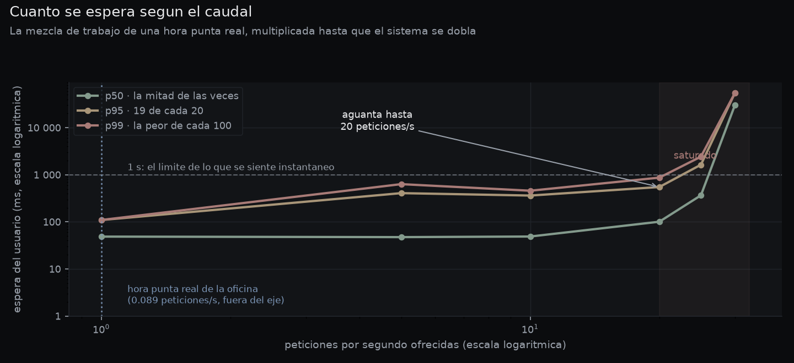
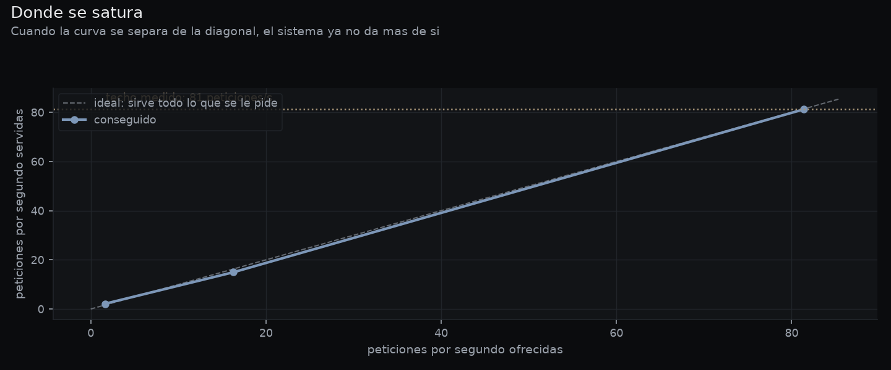
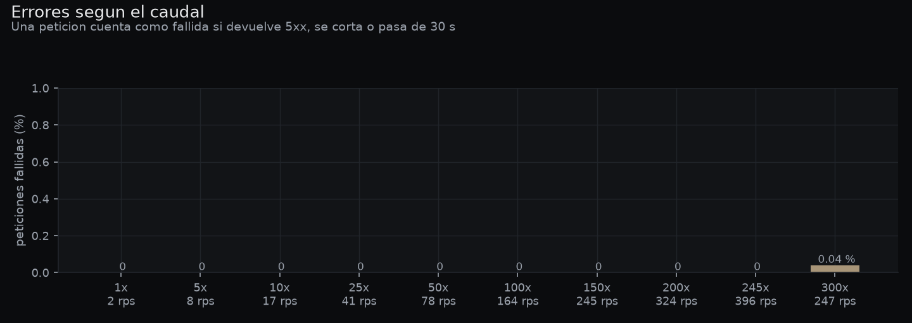
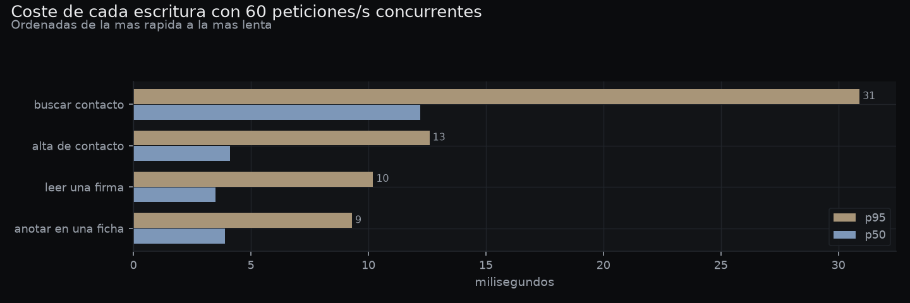
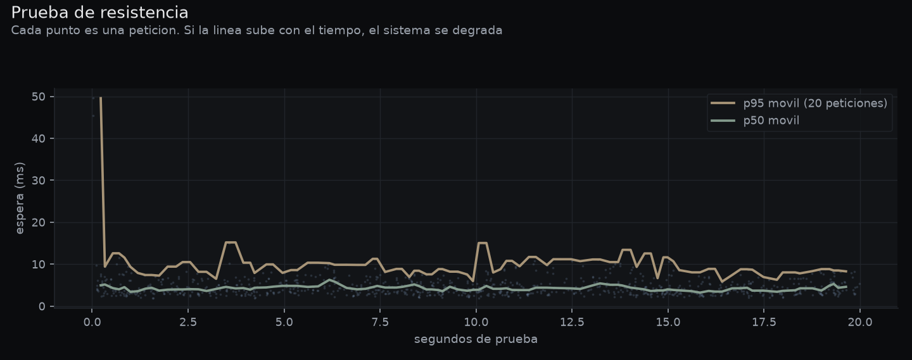
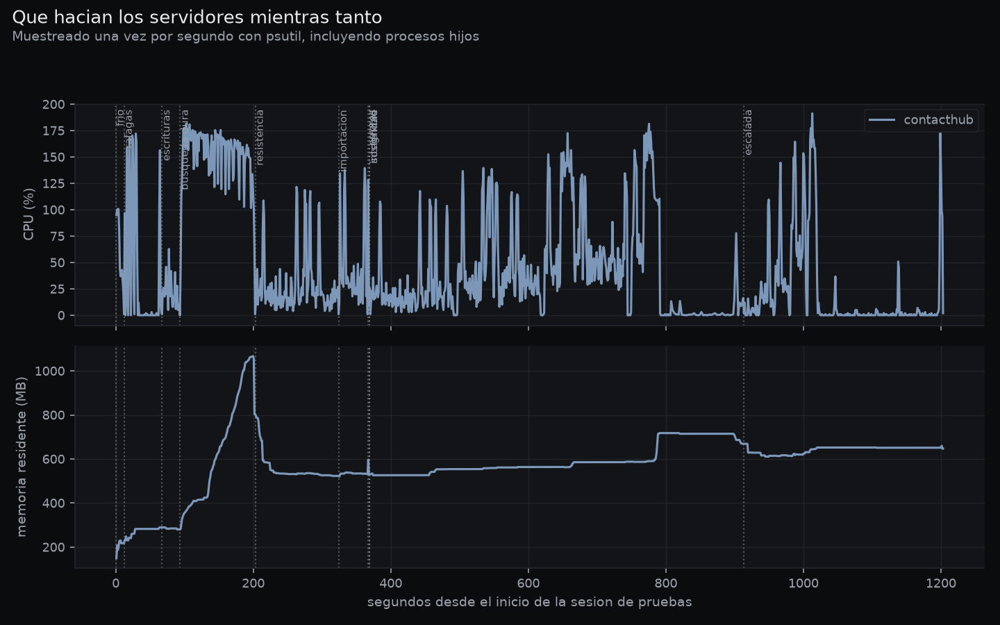
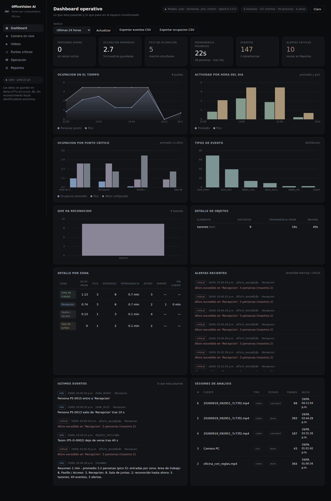
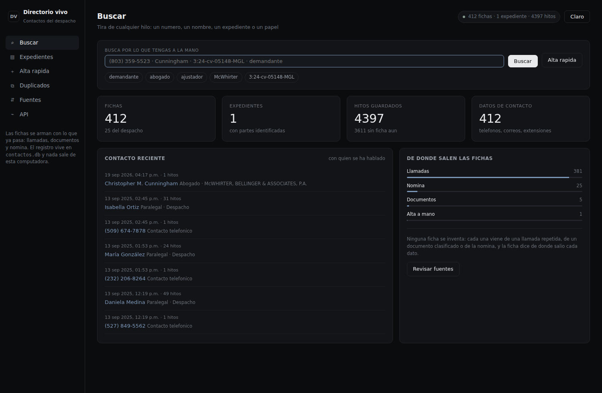
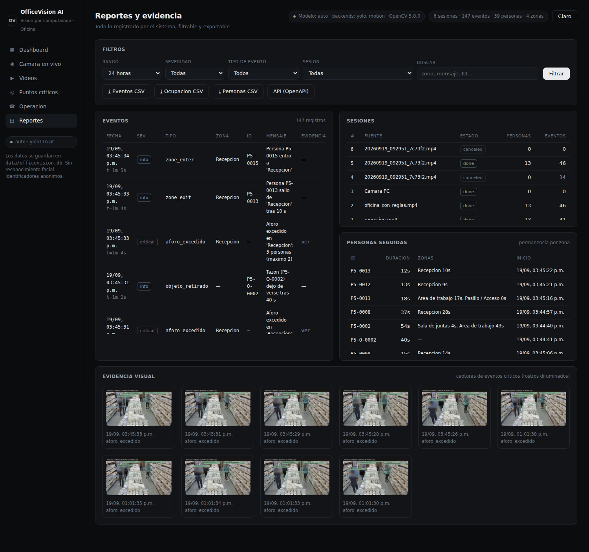

# Pruebas de tráfico, carga y tolerancia a errores

**Reto 7.** Diseño, implementación y ejecución de pruebas propias sobre la solución
construida, con la medición y la interpretación de lo que arrojan.

> Proyecto independiente: **este documento se lee solo**. El arnés de pruebas vive en
> `pruebas/` y se lanza con `python run_pruebas.py`. Por la naturaleza del reto, es el
> único que necesita a las demás aplicaciones: son el sistema al que se le aplica la
> carga, y el propio comando las arranca.

Entregables de este documento:

1. Scripts y configuración de las pruebas, con instrucciones para reproducirlas (§2 y §3).
2. Instrucciones de instalación, configuración y ejecución (§3).
3. Descripción del escenario diseñado y su justificación (§1).
4. Resultados ejecutados: métricas, gráficas y registros (§4 a §9).

---

## 1. El escenario, y por qué es ése

Una prueba de carga sin un número detrás es teatro. El tamaño de la carga de este
proyecto no se eligió: **se midió en los datos reales del despacho**.

### 1.1 De dónde sale la cifra

En `sample_data/RingCentral_History.xlsx` hay **4 000 llamadas de 24 días**. Agrupadas
por hora:

| Medida | Valor |
|---|---|
| Llamadas en la hora más cargada (23/08/2025, 09:00) | **56** |
| Mediana de una hora con actividad | 16 |
| Llamadas por día (mediana) | 170 |
| Personas en nómina | 25 |

Esa hora pico de 56 llamadas es el techo real de la oficina. De ahí se deriva todo lo
demás, contando lo que pasa **por cada llamada**:

| Origen del tráfico | Cómo se calcula | Peticiones/s |
|---|---|---|
| Búsqueda en el directorio al entrar una llamada | 56 / 3 600 | 0,016 |
| Paneles de video abiertos refrescándose solos | 8 pantallas / 5 s | 1,600 |
| Fichas que se abren tras la búsqueda | 60 % de las llamadas | 0,009 |
| Documentos del lote de la mañana | 12 / hora | 0,003 |
| **Carga nominal (1×)** | | **1,63** |

La conclusión incómoda y honesta es que **la oficina real genera menos de 2 peticiones
por segundo**. Por eso la prueba no se queda ahí: esa misma mezcla se multiplica ×5,
×10, ×25, ×50, ×100 y ×200 hasta encontrar dónde se dobla el sistema. Medir sólo el caso
cómodo no habría demostrado nada.

### 1.2 Las siete pruebas y qué busca cada una

| # | Prueba | Qué pregunta responde |
|---|---|---|
| 0 | **Arranque en frío** | ¿Cuánto espera la primera persona del día en cada pantalla? |
| 1 | **Escalada** | ¿A partir de qué caudal deja de sentirse instantáneo? |
| 2 | **Ráfaga** | ¿Y si entran todas de golpe, desde reposo? |
| 3 | **Escrituras concurrentes** | ¿Aguanta SQLite que varias personas escriban a la vez? |
| 4 | **Resistencia** | ¿Se degrada o se le va la memoria si la carga no para? |
| 5 | **Video en proceso** | ¿Sigue respondiendo mientras analiza un video? |
| 6 | **Tolerancia a errores** | ¿Qué hace cuando la petición viene mal o es maliciosa? |

Y una comprobación final, la número 7: **¿los datos siguen intactos después de todo eso?**

### 1.3 Dos decisiones de método que cambian lo que se mide

**Llegadas de Poisson, no un bucle cerrado.** Lo habitual —"N usuarios que piden, esperan
la respuesta y vuelven a pedir"— esconde la saturación: si el servidor se frena, el
generador también, y las latencias salen bonitas. Aquí las peticiones se programan a una
tasa fija con intervalos exponenciales, como llega el tráfico real; si el servidor no da
abasto, la cola crece y se ve.

**Se mide la espera del usuario, no la del servidor.** El reloj arranca cuando la
petición *debía* salir, no cuando sale. Esa diferencia se llama *coordinated omission* y
es justo lo que se siente cuando un sistema empieza a ir mal. El informe guarda las dos:
`latencia_ms` (lo que espera la persona) y `servicio_ms` (lo que tarda el servidor).

**Consultas distintas en cada petición.** Las búsquedas rotan entre 15 consultas reales
—teléfonos del historial, apellidos del expediente, números de caso, papeles procesales—.
Repetir siempre la misma habría medido la caché del sistema operativo, no la búsqueda.

---

## 2. Qué se entrega y dónde está

| Archivo | Qué es |
|---|---|
| `run_pruebas.py` | El comando único: arranca, mide, vigila, dibuja y limpia |
| `pruebas/carga.py` | Motor de carga: llegadas de Poisson, un proceso o varios, percentiles |
| `pruebas/escenarios.py` | La mezcla de tráfico y los 22 casos borde, con su justificación en el código |
| `pruebas/monitor.py` | Vigilancia de CPU, memoria, hilos y conexiones de cada servidor |
| `pruebas/orquesta.py` | Ciclo de vida de los servidores y los siete escenarios |
| `pruebas/reporte.py` | Las gráficas |
| `data/pruebas/<fecha>/` | Datos en crudo: **una fila por petición**, más `informe.json` y los logs |
| [`docs/resultados/carga-registro.txt`](resultados/carga-registro.txt) | **Transcripción completa** de una sesión: qué se ejecutó, en qué orden y con qué resultado |
| [`docs/resultados/carga-peticiones-x245.csv`](resultados/carga-peticiones-x245.csv) | **Registro de peticiones** del nivel de 399 pet./s: 7 952 filas, una por petición |
| `docs/resultados/carga-log-*.txt` | Salida de cada servidor durante la sesión |
| `docs/resultados/carga-*.csv` | Medidas de recursos y de la prueba de resistencia |
| `docs/img/carga-*.png` | Gráficas y capturas de pantalla bajo carga |

No hace falta ninguna herramienta externa —ni Locust, ni JMeter, ni k6—: se usa `httpx`,
que ya viene con FastAPI, y `psutil`. Así la prueba se ejecuta con las mismas
dependencias que el proyecto y no hay nada más que instalar ni configurar.

---

## 3. Cómo reproducirlo

```bash
# 1) Dependencias (las mismas del proyecto)
pip install -r requirements.txt

# 2) Comprobar el entorno
python run_pruebas.py --check

# 3) La sesión completa (~10 minutos)
python run_pruebas.py
```

No hay que arrancar nada a mano: el propio script levanta las tres aplicaciones que no
estén corriendo, y **respeta las que ya lo estén** (no las apaga al terminar).

Opciones útiles:

```bash
python run_pruebas.py --rapido          # versión corta, ~90 s, para comprobar que va
python run_pruebas.py --solo errores    # sólo la batería de casos borde
python run_pruebas.py --solo escalada rafaga
python run_pruebas.py --sin-video       # omitir la prueba más lenta
```

**La prueba limpia lo que ensucia.** Todo lo que escriben los escenarios lleva una marca
(`Prueba de carga`, `Carga Prueba …`) y se borra al terminar, para no tener que rehacer
los datos de demostración después de cada ejecución. El informe dice cuántos registros
retiró.

---

## 4. El instrumento mentía: cómo se detectó y qué se hizo

Ésta es la parte que más cambió el resultado, así que va antes que los datos.

En la primera ejecución completa el sistema parecía **desplomarse a 326 peticiones/s**:
p95 de 256 segundos y un 32 % de peticiones caducadas. La conclusión fácil habría sido
"el techo son 166 peticiones/s". Pero el monitor decía otra cosa:

> Durante el desplome, los tres servidores sumaban **11 % de CPU** de los 400 %
> disponibles, y la máquina entera estaba al 27 %. **Nada estaba saturado.**

Si nada está saturado y las latencias se disparan, el que se ahoga es el medidor. El
generador era un único proceso de Python: su bucle de eventos y su pool de conexiones
tocaban techo antes que el servidor. Se comprobó con una prueba A/B, misma carga contra
el mismo sistema, cambiando sólo el número de procesos generadores:

| Caudal ofrecido | 1 proceso generador | 4 procesos generadores |
|---|---|---|
| 200 pet./s | p50 **53 ms**, p95 **916 ms** | p50 5 ms, p95 13 ms |
| 330 pet./s | p50 **15 371 ms**, sólo 105 servidas | p50 7 ms, **333 servidas** |

Queda demostrado: por encima de unas **200 peticiones/s un solo proceso generador
distorsiona la medida**. El motor pasó a repartir la carga entre cuatro procesos del
sistema operativo por encima de ese umbral (`TECHO_UN_PROCESO = 150` en
`pruebas/orquesta.py`), y todos los números de §5 en adelante están tomados así.

**Segundo fallo del instrumento, también corregido.** El monitor daba 0 % de CPU para
los procesos hijos. `psutil.cpu_percent()` mide *desde la llamada anterior sobre el mismo
objeto*, y el monitor creaba los objetos de nuevo en cada muestra: todas las lecturas
eran "la primera" y salían a cero. Ahora los objetos de los hijos se guardan y se
reutilizan.

---

## 5. Resultados

Ejecución del 19/09/2026, **465 segundos**, sobre Linux con **4 núcleos y 16,9 GB**, con
las tres aplicaciones y los generadores en la misma máquina. Datos en crudo en
[`docs/resultados/carga-informe.json`](resultados/carga-informe.json).

> Las tablas y gráficas de este apartado son de la **sesión 1**. La transcripción
> (`carga-registro.txt`), el registro de peticiones y los logs de servidor que se
> entregan son de la **sesión 2**, que repitió los mismos escenarios mientras se tomaban
> las capturas de pantalla. Las dos se comparan en §5.9.

### 5.1 Escalada: aguanta 245 veces la hora pico real



| Nivel | Ofrecidas | Servidas | p50 | p95 | p99 | Errores |
|---|---:|---:|---:|---:|---:|---:|
| ×1 (hora pico real) | 1,6 | 2,0 | 6 ms | 9 ms | 11 ms | 0 % |
| ×10 | 16 | 17 | 4 ms | 9 ms | 10 ms | 0 % |
| ×50 | 81 | 78 | 4 ms | 10 ms | 14 ms | 0 % |
| ×100 | 163 | 164 | 4 ms | 11 ms | 64 ms | 0 % |
| ×150 | 244 | 245 | 5 ms | 14 ms | 126 ms | 0 % |
| ×200 | 326 | 324 | 6 ms | 22 ms | 176 ms | 0 % |
| **×245** | **399** | **396** | **8 ms** | **75 ms** | 312 ms | **0 %** |
| ×300 | 489 | 247 | 11 896 ms | 29 445 ms | 33 930 ms | 0,04 % |

**El techo medido es de ~400 peticiones por segundo**, que son **245 veces** la hora más
cargada que ha tenido la oficina en 24 días de historial. Hasta ese punto ninguna
petición falla y la espera se mantiene por debajo de una décima de segundo.



Esta gráfica es la que de verdad define el límite: mientras la curva sigue a la diagonal
el sistema va sobrado; donde se separa, ya no da más de sí. **Se separa a 400.**

### 5.2 Qué es exactamente lo que se satura

Entre 400 y 500 peticiones/s, con la atribución de CPU por proceso:

| Caudal | Servidas | p95 | CPU pico de `video` | CPU total de la máquina |
|---|---:|---:|---:|---:|
| 400 | 396 | 158 ms | 68 % | de 400 % disponibles |
| 450 | 382 | 5 282 ms | 74 % | |
| 500 | 272 | 12 934 ms | **103 %** | |

El patrón es inconfundible: **un proceso clavado en el 100 %, es decir un núcleo entero,
mientras los otros tres están ociosos.** No es falta de máquina: es que cada aplicación
corre con **un solo trabajador de uvicorn**, y un bucle de eventos vive en un único
núcleo.

La solución conocida es arrancar con varios trabajadores (`uvicorn --workers 4`), lo que
multiplicaría el techo por cuatro. **No se ha hecho, y es una decisión consciente**: las
tres aplicaciones guardan estado en el proceso —la sesión de cámara en vivo, la cola de
trabajos de video, la conexión única a SQLite— y repartirlas entre procesos exigiría
sacar ese estado fuera (Redis o similar). Para una oficina de 25 personas que genera 1,6
peticiones/s, **gastar esa complejidad para pasar de 245× a 980× el pico real no tiene
ninguna justificación.** Queda escrito por si algún día la tiene.

### 5.3 Errores



**Cero peticiones fallidas hasta 400 por segundo.** En el nivel de 489 —ya saturado— el
0,04 % que falla lo hace por caducidad a los 30 segundos, no por error del servidor: el
sistema encola en vez de romperse.

### 5.4 Ráfaga: 500 de golpe, ninguna se cae

| A la vez | p50 | p95 | Máxima | Errores |
|---:|---:|---:|---:|---:|
| 10 | 29 ms | 31 ms | 31 ms | 0 % |
| 50 | 129 ms | 148 ms | 150 ms | 0 % |
| 100 | 327 ms | 426 ms | 443 ms | 0 % |
| 250 | 982 ms | 2 035 ms | 2 214 ms | 0 % |
| 500 | 4 483 ms | 6 499 ms | 6 509 ms | 0 % |

La espera crece de forma **lineal con la concurrencia** —el comportamiento de una cola
sana— y **ninguna petición se pierde**, ni siquiera con 500 clientes simultáneos desde
reposo. Un sistema que se rompiera devolvería 5xx o cerraría conexiones; éste hace
esperar, que es lo correcto.

### 5.5 Escrituras concurrentes: la prueba que más importaba



Es el escenario que pone a prueba la decisión de arquitectura más discutible del
proyecto: **una sola conexión SQLite serializada con un cerrojo**. A 60 escrituras por
segundo durante 25 segundos, con altas, notas y lecturas de firma mezcladas con
búsquedas:

| Operación | Peticiones | p50 | p95 | Errores |
|---|---:|---:|---:|---:|
| Alta de contacto | 322 | 4 ms | 13 ms | 0 % |
| Anotar en una ficha | 431 | 4 ms | 9 ms | 0 % |
| Leer una firma | 283 | 4 ms | 10 ms | 0 % |
| Buscar mientras se escribe | 456 | 12 ms | 31 ms | 0 % |

**Cero errores y p95 por debajo de 31 ms.** La decisión de serializar aguanta de sobra el
uso real; el modo WAL permite que las lecturas no esperen a las escrituras, que es lo que
se ve en la última fila.

### 5.6 Resistencia: ni degradación ni fugas



120 segundos seguidos a 50 peticiones/s: **p95 de 10 ms, cero errores** y la línea plana
de principio a fin. Sobre la memoria, que es la pregunta de verdad:

| Aplicación | Memoria al empezar | Al terminar | Deriva |
|---|---:|---:|---:|
| video | 604,8 MB | 604,3 MB | **−0,5 MB** |
| contactos | 83,3 MB | 83,3 MB | **0,0 MB** |
| documentos | 55,7 MB | 55,7 MB | **0,0 MB** |

**Ninguna fuga.** El salto de 583 a 890 MB que se ve en `video` durante toda la sesión no
es una fuga: es el modelo YOLO11n cargándose cuando entra el primer trabajo de video, y
se queda ahí a propósito para no recargarlo en cada trabajo.



Se leen los escalones de la escalada, el pico del trabajo de video a los 425 segundos
(190 % de CPU, es decir dos núcleos) y las líneas de memoria planas de las otras dos
aplicaciones.

### 5.7 Video pesado mientras alguien consulta

Se subió un video y, mientras el sistema lo analizaba cuadro a cuadro, se siguió pidiendo
el panel en vivo, el estado del trabajo y búsquedas de contactos:

| Medida | Valor |
|---|---|
| Espera del panel durante el análisis | p50 **4,9 ms** · p95 **11,1 ms** · máxima 36,8 ms |
| Errores | **0 de 205** |
| CPU del proceso de video | hasta 190 % (dos núcleos) |
| El trabajo terminó | 12 personas únicas, 45 eventos registrados |

El trabajo pesado **no bloquea la interfaz**: corre en un hilo aparte y las consultas
siguen respondiendo en milisegundos. Era el riesgo principal del diseño de la aplicación
de video y queda descartado.

### 5.8 Arranque en frío: lo que espera la primera persona del día

| Pantalla | Primera vez | Repetida |
|---|---:|---:|
| Contactos · buscar | 3 ms | 2 ms |
| Documentos · bandeja | 3 ms | 2 ms |
| Video · panel en vivo | 2 ms | 1 ms |
| Contactos · métricas | 13 ms | 2 ms |
| **Video · estado del sistema** | **1 086 ms** | 2 ms |
| **Contactos · duplicados** | **647 ms** | **691 ms** |

Dos casos que sólo aparecen midiendo, y que son distintos entre sí:

* **Estado del sistema, 1,1 s la primera vez y 2 ms después.** Sondear qué detectores hay
  disponibles importa PyTorch. Ya estaba cacheado, pero **lo pagaba el primer usuario**.
  Corregido: ahora el sondeo se lanza en segundo plano al arrancar el servidor. La medida
  de 1 086 ms se tomó a menos de un segundo del arranque, es decir en el peor momento
  posible; quien abra la pantalla unos segundos después ya no espera nada.
* **Duplicados, 650 ms — y las dos veces.** Eso no es arranque en frío: es que el
  detector compara cada ficha con todas las demás sobre 412 personas. Es el único punto
  del sistema con coste cuadrático y está documentado como tal en §7.

### 5.9 Repetibilidad: la sesión se ejecutó dos veces

Las tablas y gráficas de arriba son de la **sesión 1** (`20260919_160448`). La sesión 2
(`20260919_163348`) repitió exactamente los mismos escenarios, **con un navegador abierto
tomando capturas al mismo tiempo**, para ver si los números aguantan:

| Nivel | Servidas · sesión 1 | Servidas · sesión 2 | p95 · sesión 1 | p95 · sesión 2 |
|---|---:|---:|---:|---:|
| ×50 (81 pet./s) | 78,1 | 78,1 | 10 ms | 9 ms |
| ×100 (163) | 164,2 | 164,8 | 11 ms | 14 ms |
| ×150 (244) | 245,2 | 244,9 | 14 ms | 15 ms |
| ×200 (326) | 323,7 | 322,0 | 22 ms | 22 ms |
| **×245 (399)** | **395,6** | **395,0** | 75 ms | **232 ms** |
| ×300 (489) | 247,4 | 258,2 | 29 445 ms | 28 613 ms |

**El caudal servido se repite con menos del 0,4 % de diferencia** en todos los niveles, y
el punto de saturación es el mismo. El único número que se mueve de verdad es el p95 en
el nivel de 399 pet./s: 75 ms frente a 232 ms. La explicación está en el propio diseño de
la sesión 2 —un Chromium cargando páginas completas mientras se medía, compitiendo por los
mismos 4 núcleos— y confirma lo que ya decía §5.2: **a partir de 400 pet./s la máquina
manda**, y cualquier cosa que consuma CPU al lado se nota.

Lo mismo en el resto de escenarios: ráfagas y resistencia con cero errores en las dos, y
**22 de 22 casos borde correctos en ambas**.

### 5.10 Las pantallas, bajo carga

Las capturas están tomadas **mientras las pruebas castigaban al sistema** a más de 160
peticiones por segundo, no antes ni después.



El panel operativo responde y se dibuja entero mientras el generador lo bombardea: 147
eventos, 39 personas seguidas, 4 zonas, las seis gráficas y las alertas críticas con su
evidencia. Abajo a la derecha se ven las sesiones de análisis que dejaron las propias
pruebas, incluidos los trabajos de video que se cancelaron al apagar los servidores entre
escenarios.



El directorio, a la vez, muestra sus cifras subidas por las altas que la prueba estaba
creando en ese momento (se retiran al terminar).



---

## 6. Tolerancia a errores y seguridad

22 peticiones mal formadas, inexistentes o abiertamente maliciosas. La regla del examen:
**un error del cliente se contesta con 4xx y un mensaje; un 5xx significa que el servidor
se rompió, y eso no es aceptable.**

| Caso | Se esperaba | Se obtuvo |
|---|---|---|
| Ficha / expediente / documento inexistente | 404 | 404 ✓ |
| Identificador no numérico | 422 | 422 ✓ |
| Alta sin nombre | 400 | 400 ✓ |
| **JSON malformado** | 400 | 400 ✓ *(era 500)* |
| **Cuerpo vacío donde se espera JSON** | 400 | 400 ✓ *(era 500)* |
| Nota vacía | 400 | 400 ✓ |
| Consulta de 200 000 caracteres | no romperse | 200, la procesa ✓ |
| `'; DROP TABLE personas;--` | 200 sin efecto | 200, y la tabla sigue ahí ✓ |
| Fusionar una ficha consigo misma | 400 | 400 ✓ |
| Fusionar con ficha inexistente | 400 | 400 ✓ |
| Deshacer una fusión que no existe | 400 | 400 ✓ |
| Fuente de importación desconocida | 404 | 404 ✓ |
| Subir un `.exe` | rechazo | 400 ✓ |
| Subir un PDF corrupto | no romperse | 200, va a revisión ✓ |
| **Nombre con `../../../../etc/passwd.pdf`** | no escribir fuera | 200, guardado como `passwd.pdf` ✓ |
| Categoría sin código | 400 | 400 ✓ |
| Zona con polígono inválido | 400 | 400 ✓ |
| Trabajo de video inexistente | 404 | 404 ✓ |
| **Cancelar un trabajo inexistente** | 404 | 404 ✓ *(era 200)* |
| Parámetro negativo | no romperse | 200 ✓ |

**22 de 22 correctos · 0 errores 500.**

Tres notas sobre seguridad, porque el resultado bueno tiene explicación:

* **Inyección SQL:** todas las consultas usan parámetros (`?`), nunca concatenación de
  cadenas. La cadena `'; DROP TABLE personas;--` se busca como texto literal y no
  encuentra nada.
* **Path traversal:** el nombre que manda el cliente se reduce con `Path(nombre).name`
  antes de tocar el disco. Se comprobó dónde acabó el archivo: en
  `data/documentos/entrada/e4bc6f31_passwd.pdf`, y de ahí, ya clasificado, en
  `data/documentos/organizados/SIN-CLASIFICAR/2026/`. **No existe ningún
  `/etc/passwd.pdf`** ni ningún archivo escrito fuera de `data/`.
* **Lo que no se ha probado:** no hay autenticación en ninguna de las tres aplicaciones,
  porque están pensadas para correr en `127.0.0.1`. Si alguna se expusiera a la red de la
  oficina habría que añadirla, y entonces harían falta pruebas de autorización que aquí
  no aplican.

### Lo que se rompió, y cómo se arregló

Las pruebas encontraron **cuatro defectos reales**. No estaban en el guion: salieron de
ejecutarlas.

| # | Qué se encontró | Cómo se encontró | Arreglo |
|---|---|---|---|
| 1 | **Sólo se podía escribir una nota por ficha.** La segunda devolvía 500 | Escrituras concurrentes: 70 de 71 notas fallaban | Un índice único trataba la referencia vacía `''` como un valor; ahora se guarda `NULL`, que SQLite sí permite repetir. Con migración de las filas antiguas |
| 2 | **Un cuerpo JSON mal formado tiraba el endpoint con un 500** | Casos borde | Un lector común (`_cuerpo`) en las tres aplicaciones: si el JSON viene roto o no es un objeto, 400 con mensaje |
| 3 | **Cancelar un trabajo inexistente devolvía 200** | Casos borde | 404, para distinguir "no existe" de "no se pudo cancelar" |
| 4 | **El primer usuario pagaba 1,1 s** por sondear los detectores | Arranque en frío | El sondeo se lanza en segundo plano al arrancar |

El defecto 1 es el mejor argumento a favor de haber hecho estas pruebas: **pulsar el
botón a mano nunca lo habría encontrado**, porque la primera nota siempre funcionaba.

---

## 7. Integridad de los datos

Después de la escalada, las ráfagas, 25 segundos de escrituras concurrentes, 120 de
resistencia, un video completo y 22 peticiones maliciosas:

| Comprobación | Resultado |
|---|---|
| La ficha de Dona M. Fry sigue intacta | ✓ |
| El expediente `3:24-cv-05148-MGL` conserva sus 5 partes | ✓ |
| Tablas presentes tras el intento de inyección | ✓ |
| Fichas creadas por la propia prueba | 320, retiradas al terminar |
| Registros reales perdidos o corrompidos | **0** |

---

## 8. Conclusiones

1. **El sistema está sobradísimo para lo que se le va a pedir.** La oficina genera 1,6
   peticiones/s en su hora más cargada de 24 días; el sistema sirve 400 sin fallar una.
   Margen de **245×**.
2. **El límite está identificado y tiene nombre:** un núcleo por aplicación, porque cada
   una corre con un trabajador de uvicorn. Se sabe cómo subirlo y se sabe por qué no
   merece la pena hoy.
3. **Cuando satura, encola; no se rompe.** Ni 5xx, ni conexiones cerradas, ni datos
   corrompidos. Con 500 clientes simultáneos desde reposo, cero pérdidas.
4. **SQLite serializado aguanta.** La decisión más discutible del proyecto resiste 60
   escrituras/s con p95 de 31 ms y cero errores.
5. **No hay fugas de memoria.** 120 segundos de carga sostenida con deriva de 0 MB en las
   tres aplicaciones.
6. **El trabajo pesado no bloquea la interfaz.** Con un video analizándose, el panel
   responde en 5 ms.
7. **Las pruebas encontraron cuatro fallos reales** y los cuatro están corregidos y
   verificados.
8. **Y encontraron un fallo en sí mismas**, que era el más peligroso: el primer intento
   habría publicado un techo de 166 peticiones/s, 2,4 veces por debajo del real.

---

## 9. Límites de estas pruebas

Escrito aquí porque un informe de rendimiento sin esta sección no es creíble.

* **Todo corre en la misma máquina.** Generadores y servidores comparten 4 núcleos. A
  partir de 400 peticiones/s esa convivencia influye; se acotó midiendo la CPU de cada
  proceso por separado (los generadores no pasaron del 4 %), pero no es lo mismo que
  medir desde otra máquina por red.
* **Sin latencia de red.** Todo va por `127.0.0.1`. En una red de oficina hay que sumar
  entre 1 y 5 ms por petición, lo que cambia poco el p95 pero sí la sensación con
  conexiones malas.
* **Base de datos pequeña.** 412 personas, 4 400 hitos, 14 documentos. Las consultas
  lineales seguirán bien con diez veces más datos; **la detección de duplicados no**: es
  cuadrática y ya cuesta 650 ms con 412 fichas, así que con 4 000 costaría minutos. Es el
  primer sitio donde habría que trabajar si la base crece, y la forma de arreglarlo es
  conocida (agrupar candidatos por teléfono y por expediente antes de comparar, en vez de
  comparar todos contra todos).
* **Un solo video, de un minuto.** No se ha probado con varios trabajos de video a la
  vez, ni con una cámara IP durante horas.
* **Sin pruebas del WebSocket en vivo.** La cámara en vivo empuja cuadros por WebSocket y
  esa ruta no entra en estos escenarios: medirla bien exige simular cámaras, no clientes
  HTTP.
* **Dos ejecuciones, no diez.** La sesión completa se corrió dos veces (§5.9) y el caudal
  servido se repite con menos del 0,4 % de diferencia, pero el p95 en el nivel de
  saturación sí se mueve con lo que esté haciendo la máquina. Para decisiones finas de
  rendimiento habría que repetir cada nivel tres veces y quedarse con la mediana.
* **Sin pruebas de autenticación ni de autorización**, porque no hay (§6).
